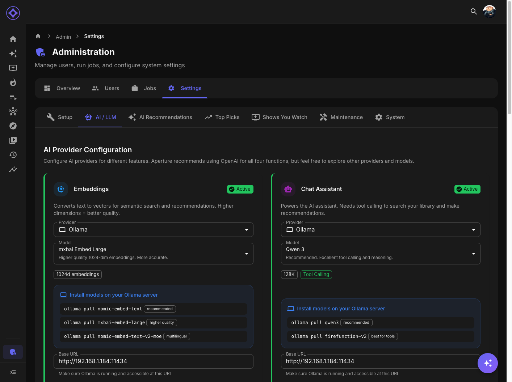

# AI Providers

Configure your AI/LLM provider for embeddings, recommendations, and the Encore chatbot.



## Accessing Settings

Navigate to **Admin → Settings → AI / LLM**

---

## Supported Providers

| Provider | Type | Best For |
|----------|------|----------|
| **OpenAI** | Cloud | Most users, best quality |
| **Ollama** | Local | Privacy, no API costs |
| **Groq** | Cloud | Fast inference |
| **Anthropic** | Cloud | Claude models |
| **Google AI** | Cloud | Gemini models |
| **DeepSeek** | Cloud | Cost-effective |
| **OpenAI-Compatible** | Various | Custom endpoints |

---

## OpenAI

The default and most well-tested provider.

### Setup

1. Get API key from [platform.openai.com](https://platform.openai.com)
2. Enter key in Aperture
3. Test connection
4. Save

### Models Available

| Purpose | Recommended Model |
|---------|-------------------|
| Embeddings | text-embedding-3-small |
| Text Generation | gpt-4o-mini |
| Chat | gpt-4o-mini |

### Costs

Pay-per-use based on tokens:
- Embeddings: ~$0.02 per million tokens
- Text: ~$0.15-$3.00 per million tokens
- Chat: ~$0.15-$15.00 per million tokens

### Pros/Cons

| Pros | Cons |
|------|------|
| Best quality | Costs money |
| Most reliable | Data sent to cloud |
| Largest context windows | Rate limits |

---

## Ollama

Run AI models locally on your own hardware.

### Prerequisites

- Ollama installed ([ollama.ai](https://ollama.ai))
- Sufficient RAM (8GB+ recommended)
- GPU recommended for speed

### Setup

1. Install Ollama
2. Pull required models:
   ```bash
   ollama pull nomic-embed-text
   ollama pull llama3.2
   ```
3. In Aperture, select "Ollama" provider
4. Enter URL: `http://host.docker.internal:11434` (Docker) or `http://localhost:11434`
5. Test and save

### Models

| Purpose | Recommended Model |
|---------|-------------------|
| Embeddings | nomic-embed-text |
| Text | llama3.2, mistral |
| Chat | llama3.2, mistral |

### Context Window

Ollama default is 4096 tokens. Aperture automatically adjusts batch sizes to fit.

### Pros/Cons

| Pros | Cons |
|------|------|
| Free after setup | Slower than cloud |
| Data stays local | Requires hardware |
| No rate limits | Smaller context windows |

---

## Groq

High-speed cloud inference.

### Setup

1. Get API key from [console.groq.com](https://console.groq.com)
2. Select "Groq" provider in Aperture
3. Enter API key
4. Test and save

### Models

| Purpose | Recommended Model |
|---------|-------------------|
| Text | llama3-8b-8192 |
| Chat | llama3-70b-8192 |

### Note

Groq doesn't provide embeddings. Use with OpenAI for embeddings + Groq for text generation.

### Pros/Cons

| Pros | Cons |
|------|------|
| Very fast | No embedding models |
| Free tier available | Rate limits |

---

## Anthropic

Claude models from Anthropic.

### Setup

1. Get API key from [console.anthropic.com](https://console.anthropic.com)
2. Select "Anthropic" provider
3. Enter API key
4. Test and save

### Models

| Purpose | Recommended Model |
|---------|-------------------|
| Text | claude-3-haiku |
| Chat | claude-3-sonnet |

### Note

Anthropic doesn't provide embeddings. Use with OpenAI for embeddings.

---

## Google AI

Google's Gemini models.

### Setup

1. Get API key from Google AI Studio
2. Select "Google AI" provider
3. Enter API key
4. Test and save

### Models

| Purpose | Recommended Model |
|---------|-------------------|
| Embeddings | text-embedding-004 |
| Text | gemini-1.5-flash |
| Chat | gemini-1.5-pro |

---

## DeepSeek

Cost-effective Chinese AI provider.

### Setup

1. Get API key from DeepSeek
2. Select "DeepSeek" provider
3. Enter API key
4. Test and save

### Models

| Purpose | Recommended Model |
|---------|-------------------|
| Text | deepseek-chat |
| Chat | deepseek-chat |

---

## OpenAI-Compatible

For custom endpoints that implement OpenAI's API format.

### Setup

1. Select "OpenAI Compatible" provider
2. Enter your custom base URL
3. Enter API key (if required)
4. Specify model names manually
5. Test and save

### Use Cases

- Self-hosted LLMs with OpenAI-compatible API
- Corporate AI endpoints
- Other providers with compatible APIs

---

## Multi-Provider Setup

You can use different providers for different purposes:

| Purpose | Provider Selection |
|---------|-------------------|
| **Embeddings** | OpenAI (best quality) or Google AI |
| **Text Generation** | Any provider |
| **Chat** | Any provider |
| **Exploration** | Any provider |

Configure each in the respective sections.

---

## Testing Connection

After configuring:

1. Click **Test Connection**
2. Aperture attempts to:
   - Validate API key
   - Check model availability
   - Verify endpoint is reachable
3. Green = success, Red = failure with error details

---

## Troubleshooting

### "Invalid API key"

- Check key is correct
- Verify account is active
- Ensure key has required permissions

### "Model not found"

- Model name may be wrong
- Model may not be available on your plan
- For Ollama, ensure model is pulled

### "Rate limited"

- Reduce job batch sizes
- Upgrade API tier
- Add delay between requests

### "Timeout"

- Ollama may need more time
- Check network connectivity
- Increase timeout settings if available

---

**Previous:** [Jellyseerr Integration](jellyseerr.md) | **Next:** [Embedding Models](embedding-models.md)
