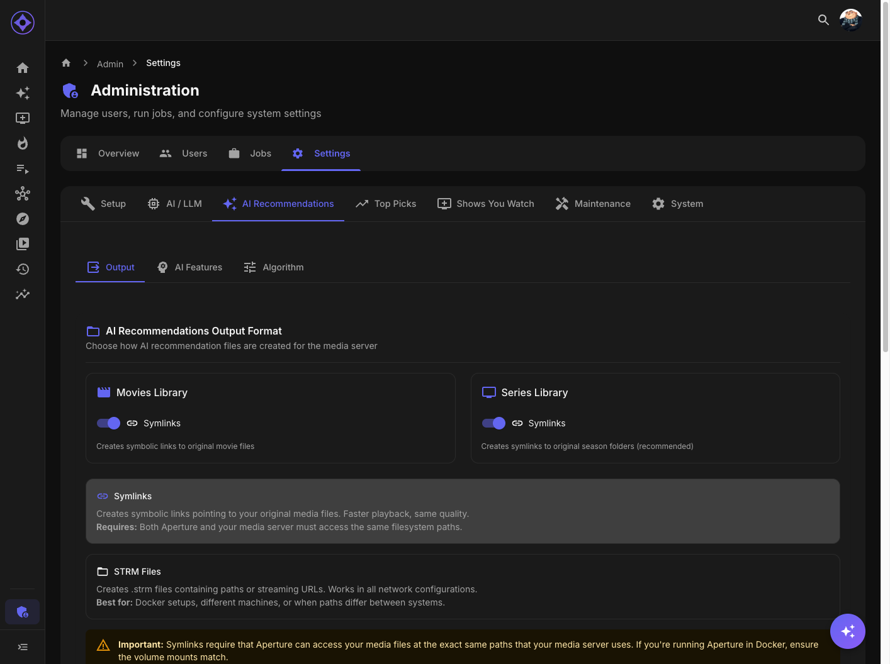

# Algorithm Tuning

Configure the recommendation algorithm weights and parameters.



## Accessing Settings

Navigate to **Admin → Settings → AI Recommendations → Algorithm**

---

## How Recommendations Work

### Scoring Process

1. Each unwatched item is scored
2. Multiple factors contribute to the score
3. Factors are weighted based on configuration
4. Highest scores become recommendations

### Score Formula

```
Final Score = (Similarity × SimWeight) + (Popularity × PopWeight) + ...
```

---

## Weight Categories

### Similarity Weight

How closely recommendations match user's taste.

| Value | Effect |
|-------|--------|
| **High (0.7+)** | More "safe" recommendations |
| **Medium (0.4-0.6)** | Balanced approach |
| **Low (0.1-0.3)** | More varied recommendations |

**Increase if:** Users want more of what they already like
**Decrease if:** Users want to discover new genres

### Popularity Weight

Preference for widely-watched content.

| Value | Effect |
|-------|--------|
| **High** | Favor mainstream hits |
| **Low** | Include hidden gems |

**Increase if:** Users trust crowd wisdom
**Decrease if:** Users prefer obscure content

### Recency Weight

Preference for newer releases.

| Value | Effect |
|-------|--------|
| **High** | Favor recent releases |
| **Low** | Include classics equally |

**Increase if:** Users want current content
**Decrease if:** Users enjoy older films

### Rating Weight

Weight given to community/critic ratings.

| Value | Effect |
|-------|--------|
| **High** | Favor highly-rated content |
| **Low** | Rating matters less |

**Increase if:** Users trust ratings
**Decrease if:** Users have unconventional taste

### Diversity Weight

Variety in the recommendation list.

| Value | Effect |
|-------|--------|
| **High** | Ensure genre variety |
| **Low** | May cluster in favorite genres |

**Increase if:** Users want diverse picks
**Decrease if:** Users have narrow preferences

---

## Default Values

| Weight | Movies Default | Series Default |
|--------|----------------|----------------|
| Similarity | 0.5 | 0.5 |
| Popularity | 0.2 | 0.2 |
| Recency | 0.1 | 0.1 |
| Rating | 0.1 | 0.1 |
| Diversity | 0.1 | 0.1 |

Weights should sum to approximately 1.0.

---

## Additional Parameters

### Recommendations Per User

How many items to generate per user.

| Setting | Effect |
|---------|--------|
| **25** | Focused, high-quality list |
| **50** | Default, good variety |
| **100** | Extensive options |

### Recent Watch Limit

How many recent watches to analyze for taste profile.

| Setting | Effect |
|---------|--------|
| **50** | Recent taste only |
| **100** | Default, balanced history |
| **200** | Deep history analysis |

---

## Separate Movie/Series Weights

Configure weights independently:

### Why Separate?

User behavior differs:
- May watch action movies but drama series
- Series require more commitment
- Different discovery patterns

### Configuration

1. Select **Movies** or **Series** tab
2. Adjust weights for that content type
3. Save independently

---

## User Overrides

Users can customize their own weights.

### How It Works

1. Admin sets global defaults
2. Users can override in User Settings → AI Algorithm
3. User settings take priority
4. Backend normalizes weights automatically

### Admin Control

Admins can:
- Set server-wide defaults
- Allow or disallow user overrides
- View individual user configurations

---

## Normalization

Weights are automatically normalized:

### Example

If user sets:
- Similarity: 80
- Popularity: 40
- Others: 20 each

Normalized to:
- Similarity: 0.44
- Popularity: 0.22
- Others: 0.11 each

Sum always equals 1.0.

---

## Tuning Strategy

### Start with Defaults

Default values work well for most users.

### Monitor Feedback

Look for patterns:
- "Recommendations are too similar" → Lower similarity
- "Missing popular stuff" → Raise popularity
- "Too many old movies" → Raise recency

### Test Changes

1. Adjust one weight at a time
2. Regenerate recommendations
3. Evaluate results
4. Iterate

### Different User Profiles

Consider different defaults for:
- Heavy watchers (lower similarity)
- New users (higher popularity)
- Cinephiles (lower popularity, higher rating)

---

## Troubleshooting

### Recommendations Too Similar

- Lower similarity weight
- Raise diversity weight
- Check user hasn't narrowed their taste

### Missing Expected Items

- Check item has embeddings
- Verify not in excluded content
- Review dislike behavior settings

### Recommendations Seem Random

- Raise similarity weight
- Check watch history synced
- Verify embeddings are generated

---

## Advanced: Scoring Details

### Similarity Score

Based on embedding distance:
- Closer embeddings = higher score
- Uses cosine similarity
- Compared against user's taste vector

### Popularity Score

Based on:
- Watch count across all users
- Recency of watches
- Play frequency

### Rating Score

Combines:
- Community rating (Emby/Jellyfin)
- Rotten Tomatoes (if available)
- Metacritic (if available)

---

**Previous:** [AI Explanations](ai-explanations.md) | **Next:** [Top Picks Configuration](top-picks.md)
