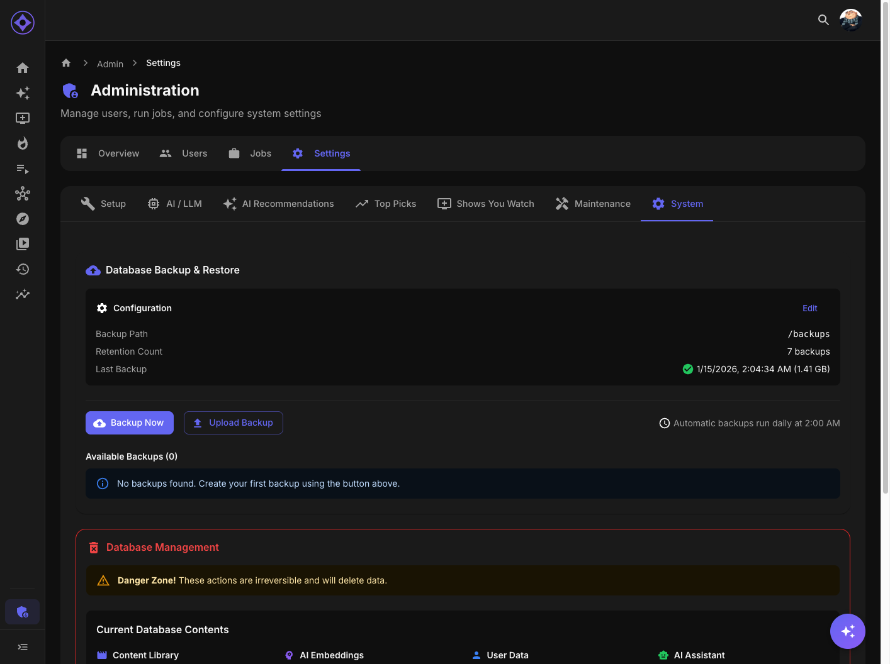

# Backup & Restore

Protect your data with automatic and manual backups.



## Accessing Settings

Navigate to **Admin → Settings → System** (Backup & Restore section)

---

## What Gets Backed Up

| Data | Included |
|------|----------|
| **Database** | All tables, users, ratings, recommendations |
| **Settings** | All configuration |
| **Job schedules** | Custom schedules |
| **User preferences** | Algorithm weights, UI preferences |

### Not Included

| Data | Why |
|------|-----|
| **Media files** | Too large, managed separately |
| **STRM/Symlink files** | Regenerated from database |
| **Cache** | Temporary, regenerated |

---

## Automatic Backups

### Schedule

Default: Daily at 1:00 AM

Configure in Admin → Jobs → database-backup

### Retention

Default: Keep 7 backups

Older backups are automatically deleted.

### Storage Location

Backups stored in `/backups` volume mount:
```
/backups/
├── aperture_backup_2025-01-15_02-00-00.dump
├── aperture_backup_2025-01-14_02-00-00.dump
└── ...
```

---

## Manual Backup

### Creating a Backup

1. Navigate to Admin → Settings → System
2. Scroll to Backup & Restore
3. Click **Create Backup**
4. Wait for completion
5. Backup appears in list

### Download Backup

1. Find backup in list
2. Click **Download**
3. Save to secure location

Recommended: Download backups for offsite storage.

---

## Restore Process

### During Initial Setup

1. Start fresh Aperture instance
2. First wizard step offers restore
3. Upload backup file or select from list
4. Wizard restores data
5. Continue with remaining setup steps

### From Admin Panel

1. Navigate to Admin → Settings → System
2. Scroll to Backup & Restore
3. Click **Restore** on desired backup
4. Confirm action
5. Wait for completion
6. Aperture restarts with restored data

---

## Backup File Format

### Structure

Backups are PostgreSQL custom-format archives written by `pg_dump -F c`:

- Format: `.dump` (compressed internally at level 6)
- Contains: Full database schema and data
- Restored with: `pg_restore`, not `psql`
- Size: Depends on library size

Older installations may still have `.sql.gz` files from previous versions. Those are plain
SQL and restore through `psql`. Aperture's restore handles both automatically.

### Restoring outside Aperture

The admin panel restore is the supported path. If you restore by hand, use the tools from
the **app** container rather than the database container — they are guaranteed to match the
version that wrote the backup:

```bash
docker exec -i aperture-db pg_restore -U app -d aperture --no-owner --no-acl \
  < /path/to/aperture_backup_2025-01-15_02-00-00.dump
```

Restoring into a database that already has tables fails with "already exists" errors. Clear
it first:

```bash
docker exec -i aperture-db psql -U app -d aperture \
  -c 'DROP SCHEMA public CASCADE; CREATE SCHEMA public;'
```

Aperture's own restore adds `--clean --if-exists`, so it does not need this step.

### Typical Sizes

| Library Size | Approximate Backup Size |
|--------------|------------------------|
| Small (<500) | 5-20 MB |
| Medium (500-2000) | 20-100 MB |
| Large (2000+) | 100-500 MB |

---

## Restore Scenarios

### New Server Migration

1. Download backup from old server
2. Install Aperture on new server
3. Upload backup during setup
4. Reconfigure media server connection
5. Re-run library sync jobs

### Disaster Recovery

1. Reinstall Aperture
2. Restore from most recent backup
3. Verify data integrity
4. Resume normal operation

### Rollback After Issues

1. Stop Aperture
2. Restore from pre-issue backup
3. Identify and fix issue
4. Resume operation

---

## Best Practices

### Regular Backups

- Keep automatic daily backups enabled
- Download weekly for offsite storage
- Store in multiple locations

### Before Major Changes

Create manual backup before:
- Changing embedding models
- Purging database
- Major version updates
- Configuration changes

### Testing Restores

Periodically test restore process:
1. Create test environment
2. Restore backup
3. Verify data integrity
4. Confirm functionality

---

## Retention Configuration

### Setting Retention

In Admin → Jobs → database-backup configuration:

| Setting | Description |
|---------|-------------|
| **Keep N backups** | Number of backups to retain |
| **Delete older** | Remove backups exceeding count |

### Recommendations

| Use Case | Retention |
|----------|-----------|
| Limited storage | 3-5 backups |
| Normal | 7 backups (1 week) |
| Cautious | 14-30 backups |

---

## Troubleshooting

### Backup Fails

1. Check disk space in backup volume
2. Verify database is accessible
3. Review job logs for errors
4. Check file permissions

### Restore Fails

1. Verify backup file is valid
2. Check file isn't corrupted
3. Ensure sufficient disk space
4. Review error messages

#### `unsupported version (1.16) in file header`

The tools you are restoring with are older than the tools that wrote the backup.
`pg_restore` can read archives from older versions of `pg_dump`, but never from newer ones.

**Aperture's own restore is not affected.** It uses the PostgreSQL 17 client bundled in the
app container, which reads every archive Aperture has ever written. Restore through
Admin → Settings → System and this does not arise.

You will hit it if you restore by hand *inside* the `aperture-db` container, because the
bundled database is PostgreSQL 16 and its `pg_restore` cannot read a 1.16 archive. Use a
client at least as new as the one that wrote the file:

```bash
docker run --rm -i --network container:aperture-db -e PGPASSWORD=app \
  pgvector/pgvector:pg17 \
  pg_restore -h 127.0.0.1 -U app -d aperture --no-owner --no-acl \
  < /path/to/backup.dump
```

Aperture logs both versions at startup, so `docker logs aperture` will tell you which
client it is using.

#### `relation "..." already exists`

The database already contains tables. Aperture creates its schema on first start, so a fresh
install is never empty. Drop the schema before restoring — see
[Restoring outside Aperture](#restoring-outside-aperture).

#### `unrecognized configuration parameter "transaction_timeout"`

Harmless. A newer `pg_restore` emitted a session setting that an older server does not
recognize. Your data still restores correctly, but `pg_restore` exits non-zero, so check row
counts rather than the exit code.

#### `aborting because of server version mismatch`

`pg_dump` refuses to run against a server newer than itself, so backups cannot be created.
This means your database was upgraded past the version Aperture's bundled client supports.
See [PostgreSQL 17 Migration](postgres-17-migration.md).

### Backup Too Large

- More backups = more space needed
- Consider reducing retention
- Clean old data before backing up

---

## Security

### Backup Contents

Backups contain sensitive data:
- User information
- API keys (encrypted)
- Watch history
- Ratings

### Protect Backups

- Store in secure location
- Encrypt offsite backups
- Limit access to backup volume
- Use secure transfer methods

---

**Previous:** [Maintenance](maintenance.md) | **Next:** [PostgreSQL 17 Migration](postgres-17-migration.md)
