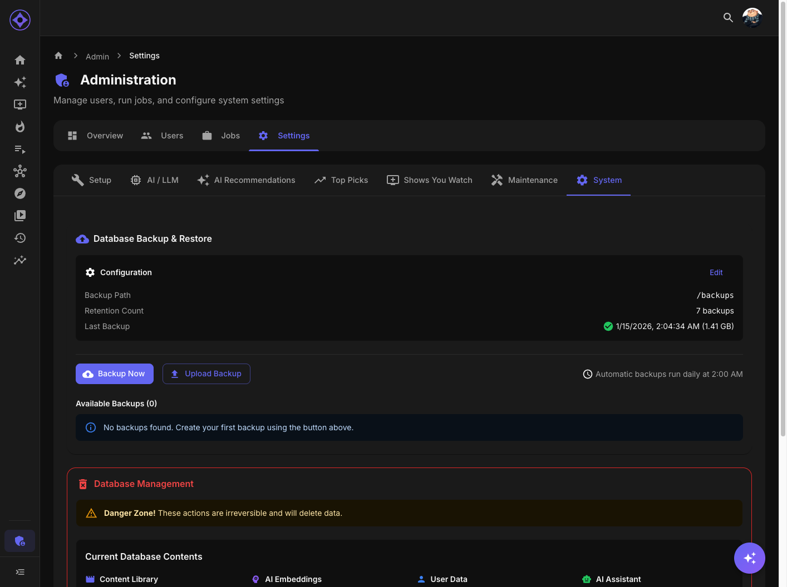

# Database Management

View database statistics and perform data management operations.



## Accessing Settings

Navigate to **Admin → Settings → System** (Database section)

---

## Database Statistics

### Overview Stats

| Stat | Description |
|------|-------------|
| **Movies** | Total movies in database |
| **Series** | Total TV series |
| **Episodes** | Total episodes |
| **Users** | Registered users |
| **Embeddings** | AI vectors generated |
| **Ratings** | User ratings count |
| **Watch History** | Watch records |

### Storage Stats

| Stat | Description |
|------|-------------|
| **Database Size** | Total PostgreSQL size |
| **Embeddings Size** | Vector storage |
| **Index Size** | Database indexes |

---

## Viewing Statistics

1. Navigate to Admin → Settings → System
2. Database section shows current counts
3. Click **Refresh** to update

### Understanding Counts

| Discrepancy | Possible Cause |
|-------------|----------------|
| Movies < Library | Sync not complete |
| Embeddings < Movies | Embedding job pending |
| Users < Media Server | User sync needed |

---

## Data Purge

### Warning

**Purging deletes data permanently.** This cannot be undone.

### When to Purge

- Switching media servers
- Starting fresh
- Removing test data
- Major reconfiguration

### Purge Options

| Option | What's Deleted |
|--------|----------------|
| **Movies** | All movie data, embeddings, recommendations |
| **Series** | All series data, embeddings, recommendations |
| **All Content** | Movies + Series |
| **Watch History** | All watch records |
| **Ratings** | All user ratings |
| **Everything** | Complete database reset |

### Purge Process

1. Select what to purge
2. Review warning showing counts
3. Type confirmation text: "yes I am sure"
4. Click **Purge**
5. Wait for completion

### After Purging

Depending on what was purged:
1. Re-run sync jobs
2. Re-run embedding jobs
3. Regenerate recommendations
4. Users may need to re-rate content

---

## Confirmation Modal

Purge requires explicit confirmation:

### What's Shown

- Exact counts of data to be deleted
- Affected tables
- Warning about irreversibility

### Confirmation

Must type exactly: `yes I am sure`

Button remains disabled until confirmation matches.

---

## Database Health

### Checking Health

Look for:
- Connection status (green = healthy)
- Query performance
- Storage growth trends

### Signs of Issues

| Symptom | Possible Cause |
|---------|----------------|
| Slow queries | Missing indexes |
| Growing size | Orphaned data |
| Connection errors | Resource limits |

---

## Maintenance Operations

### Vacuum (Automatic)

PostgreSQL automatically manages:
- Dead tuple cleanup
- Space reclamation
- Statistics updates

### Manual Optimization

Rarely needed, but if performance degrades:
1. Stop Aperture
2. Connect to PostgreSQL directly
3. Run `VACUUM ANALYZE`
4. Restart Aperture

---

## Data Integrity

### Consistency Checks

Aperture maintains referential integrity:
- Foreign key constraints
- Cascade deletes
- Orphan cleanup

### Orphaned Data

Occasionally, orphaned records may exist:
- From interrupted operations
- Migration edge cases

These are typically harmless and cleaned automatically.

---

## Troubleshooting

### Database Connection Issues

1. Check PostgreSQL is running
2. Verify connection string
3. Check credentials
4. Review Docker networking

### Slow Performance

1. Check database size
2. Review query logs
3. Consider index optimization
4. Upgrade hardware if needed

### Data Inconsistencies

1. Re-run sync jobs
2. Check for interrupted operations
3. Review job logs
4. Contact support if persistent

---

## PostgreSQL Access

### Direct Access

For advanced troubleshooting:

```bash
# Connect to PostgreSQL
docker exec -it aperture-db psql -U aperture -d aperture

# View tables
\dt

# Check counts
SELECT COUNT(*) FROM movies;
SELECT COUNT(*) FROM series;
SELECT COUNT(*) FROM embeddings_1536;
```

### Security Note

Direct database access should be:
- Limited to administrators
- Used carefully
- Documented when making changes

---

**Previous:** [Backup & Restore](backup-restore.md) | **Next:** [Jobs Overview](jobs-overview.md)
