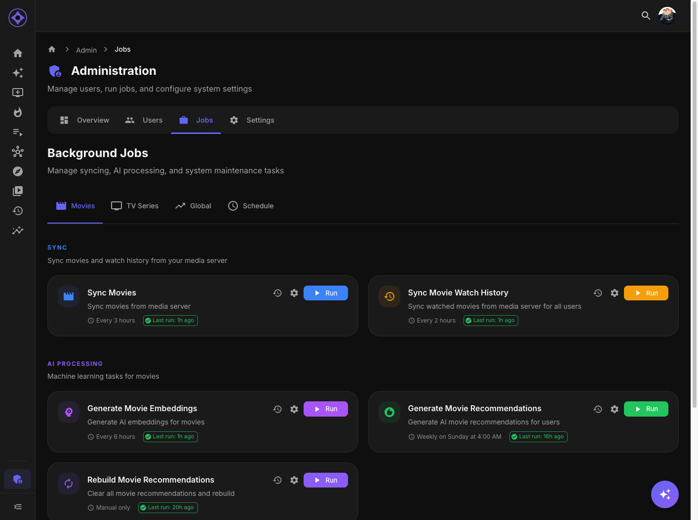

# Global Jobs

Background jobs that span content types or handle system-wide functions.



## Job List

| Job | Purpose |
|-----|---------|
| **enrich-metadata** | TMDb/OMDb enrichment |
| **enrich-studio-logos** | Fetch studio images |
| **enrich-mdblist** | MDBList score enrichment |
| **refresh-top-picks** | Update trending libraries |
| **sync-watching-libraries** | Build Shows You Watch |
| **sync-trakt-ratings** | Sync ratings with Trakt |
| **refresh-ai-pricing** | Update AI cost data |
| **generate-discovery-suggestions** | Find new content |
| **database-backup** | Backup database |
| **sync-users** | Import users from media server |

---

## enrich-metadata

Fetch additional metadata from TMDb and OMDb.

### What It Does

1. Identifies items missing enrichment data
2. Queries TMDb for keywords, collections, credits
3. Queries OMDb for RT/Metacritic scores
4. Updates database with enriched data

### Data Enriched

| Source | Data |
|--------|------|
| **TMDb** | Keywords, collections, cast, crew, backdrops |
| **OMDb** | Rotten Tomatoes, Metacritic, awards |

### When to Run

- **Scheduled:** Every 6 hours
- **Manual:** After adding new content
- **Prerequisites:** Content synced, API keys configured

### Rate Limits

| Service | Limit |
|---------|-------|
| TMDb | 40 requests/10 seconds |
| OMDb | 1,000/day (free) |

Job automatically respects limits.

---

## enrich-studio-logos

Fetch production company logos.

### What It Does

1. Identifies studios without logos
2. Queries TMDb for company images
3. Downloads and stores logos
4. Updates studio records

### When to Run

- **Scheduled:** Part of enrichment cycle
- **Manual:** If studio logos missing

---

## enrich-mdblist

Fetch MDBList scores and data.

### What It Does

1. Queries MDBList for matched content
2. Updates combined scores
3. Adds streaming availability info

### Prerequisites

MDBList API key configured.

---

## refresh-top-picks

Update trending content libraries.

### What It Does

1. Queries configured popularity source:
   - Local: Analyzes watch data
   - MDBList: Fetches list rankings
   - Hybrid: Combines both
2. Ranks items by popularity score
3. Creates/updates Top Picks libraries
4. Builds collections/playlists if enabled

### Output

- Top Picks - Movies library
- Top Picks - Series library
- Collections (if enabled)
- Playlists (if enabled)

### When to Run

- **Scheduled:** Daily
- **Manual:** After significant watch activity
- **Prerequisites:** Top Picks configured

See [Top Picks Configuration](top-picks.md) for details.

---

## sync-watching-libraries

Build Shows You Watch libraries.

### What It Does

1. For each user:
2. Analyzes series watch history
3. Identifies currently-watched ongoing series
4. Creates Shows You Watch list
5. Builds virtual library (if enabled)

### When to Run

- **Scheduled:** Daily
- **Manual:** After watch history sync
- **Prerequisites:** Series watch history synced

See [Shows You Watch Configuration](shows-you-watch.md) for details.

---

## sync-trakt-ratings

Sync ratings between Aperture and Trakt.

### What It Does

1. For users with connected Trakt:
2. Fetches ratings from Trakt
3. Updates Aperture ratings
4. Pushes Aperture ratings to Trakt

### Direction

| Direction | Behavior |
|-----------|----------|
| Trakt → Aperture | Bulk sync during job |
| Aperture → Trakt | Immediate push on rate |

### When to Run

- **Scheduled:** Every 2 hours
- **Manual:** If ratings seem out of sync
- **Prerequisites:** Trakt configured, users connected

---

## refresh-ai-pricing

Update AI provider cost information.

### What It Does

1. Fetches current model pricing
2. Updates cost calculator data
3. Refreshes model availability

### When to Run

- **Scheduled:** Weekly
- **Manual:** If pricing seems outdated

---

## generate-discovery-suggestions

Find content not in your library that matches user taste.

### What It Does

1. Analyzes user taste profiles
2. Queries external sources:
   - TMDb similar/recommended
   - Trakt recommendations (if connected)
3. Scores against user preferences
4. Stores discovery candidates

### When to Run

- **Scheduled:** Daily
- **Manual:** To refresh suggestions
- **Prerequisites:** Embeddings generated, taste profiles built

---

## database-backup

Create database backup.

### What It Does

1. Dumps PostgreSQL database
2. Compresses with gzip
3. Stores in backup volume
4. Cleans old backups (retention policy)

### Output

```
/backups/aperture-backup-2025-01-15.sql.gz
```

### When to Run

- **Scheduled:** Daily at 1 AM
- **Manual:** Before major changes
- **Prerequisites:** Backup volume mounted

See [Backup & Restore](backup-restore.md) for details.

---

## sync-users

Import users from media server.

### What It Does

1. Fetches user list from Emby/Jellyfin
2. Creates new Aperture user records
3. Updates existing user info
4. Syncs email addresses (Emby Connect)

### When to Run

- **Scheduled:** Every 30 minutes
- **Manual:** After creating users in media server
- **Prerequisites:** Media server connected

---

## Job Dependencies

### Global Job Prerequisites

| Job | Requires |
|-----|----------|
| enrich-metadata | Content synced, TMDb/OMDb keys |
| refresh-top-picks | Watch history synced |
| sync-watching-libraries | Series watch history |
| sync-trakt-ratings | Trakt configured, users connected |
| generate-discovery-suggestions | Embeddings, taste profiles |

---

## Scheduling Strategy

### Recommended Order

```
1:00 AM - database-backup
2:00 AM - sync-movies, sync-series (parallel)
3:00 AM - embeddings
4:00 AM - recommendations
5:00 AM - library builds, top-picks
Every 2h - watch history
Every 6h - enrichment
Every 30m - user sync
```

---

**Previous:** [Series Jobs](series-jobs.md) | **Next:** [User Management](user-management.md)
