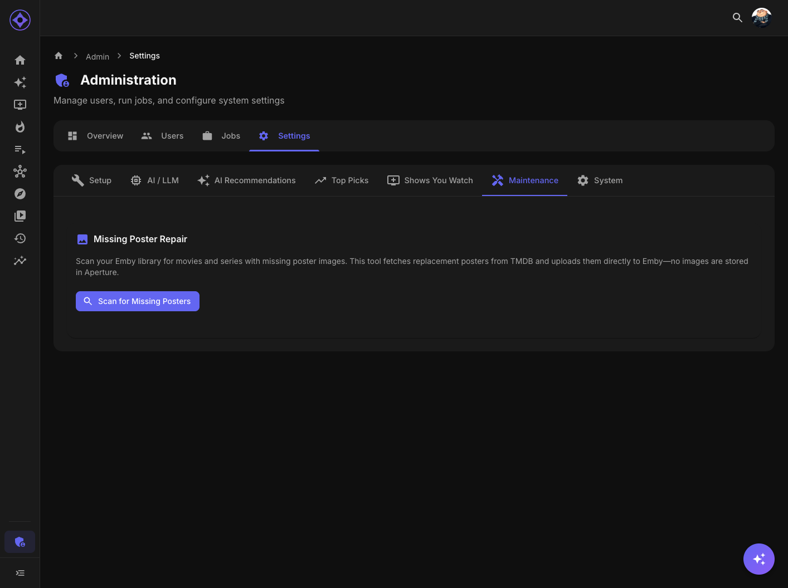

# Maintenance

Tools for maintaining Aperture's data and fixing common issues.

## Accessing Settings

Navigate to **Admin → Settings → Maintenance**

---

## Poster Repair

Fix missing or broken poster images.

### When to Use

- Posters show as placeholder images
- Media server changed poster locations
- After migrating media server
- Poster URLs expired

### How It Works

1. Click **Repair Posters**
2. Aperture scans all movies/series
3. Identifies items with missing/invalid poster URLs
4. Fetches fresh URLs from media server
5. Updates database

### Progress

Shows:
- Items scanned
- Posters updated
- Errors encountered

### Schedule

Poster repair is manual-only. Run when needed.

---

## Legacy Embeddings

Manage old embedding data from previous model configurations.

### What Are Legacy Embeddings?

When you change embedding models, old embeddings become obsolete:
- Different dimensions
- Incompatible vectors
- Take up storage space

### Viewing Legacy Data

Shows:
- Embedding tables by dimension
- Count of embeddings per table
- Storage used

### Cleanup Options

| Action | Effect |
|--------|--------|
| **Delete Legacy** | Remove old dimension tables |
| **Keep Current** | Only keep active model's embeddings |

### When to Clean Up

Clean legacy embeddings when:
- You've settled on a model
- Storage is limited
- Old data is confirmed unnecessary

### Warning

Deleted embeddings cannot be recovered. Ensure current model is working before deleting legacy data.

---

## Metadata Refresh

Force refresh of metadata from media server.

### When to Use

- Metadata changed in media server
- Posters updated
- Genres/cast modified
- Ratings changed

### Options

| Option | Description |
|--------|-------------|
| **Full Refresh** | Re-sync all metadata |
| **Changed Only** | Only items modified since last sync |

### Process

Run the relevant sync jobs:
- `sync-movies` for movie metadata
- `sync-series` for series metadata

---

## Cache Management

Clear cached data that may be stale.

### API Response Cache

Aperture caches some API responses:
- TMDb lookups
- OMDb scores
- MDBList data

### Clearing Cache

Cache automatically expires, but to force clear:
1. Restart Aperture container
2. Or wait for cache TTL

### Frontend Cache

Users can clear their browser cache for:
- Stale UI elements
- Old images
- Cached preferences

---

## Health Checks

### Database Health

Check database status:
- Connection status
- Table integrity
- Index status

### API Connections

Verify integrations:
- Media server connection
- OpenAI/AI provider
- Trakt, TMDb, etc.

### Job Status

Review job health:
- Failed jobs
- Long-running jobs
- Stuck jobs

---

## Common Maintenance Tasks

### Weekly

- Review job logs for errors
- Check for failed jobs
- Monitor storage usage

### Monthly

- Review embedding storage
- Clean legacy embeddings if needed
- Check poster health

### After Updates

- Run enrichment jobs
- Verify integrations still work
- Test recommendation generation

### After Migration

- Repair posters
- Verify path mappings
- Re-sync libraries
- Regenerate embeddings if needed

---

## Troubleshooting

### Slow Performance

1. Check database storage
2. Clean legacy embeddings
3. Review job schedules for overlap
4. Monitor during peak times

### Missing Data

1. Re-run sync jobs
2. Check library configuration
3. Verify media server connection
4. Review enrichment job status

### Image Issues

1. Run poster repair
2. Check media server poster availability
3. Verify URL accessibility

---

**Previous:** [Shows You Watch Configuration](shows-you-watch.md) | **Next:** [Backup & Restore](backup-restore.md)
