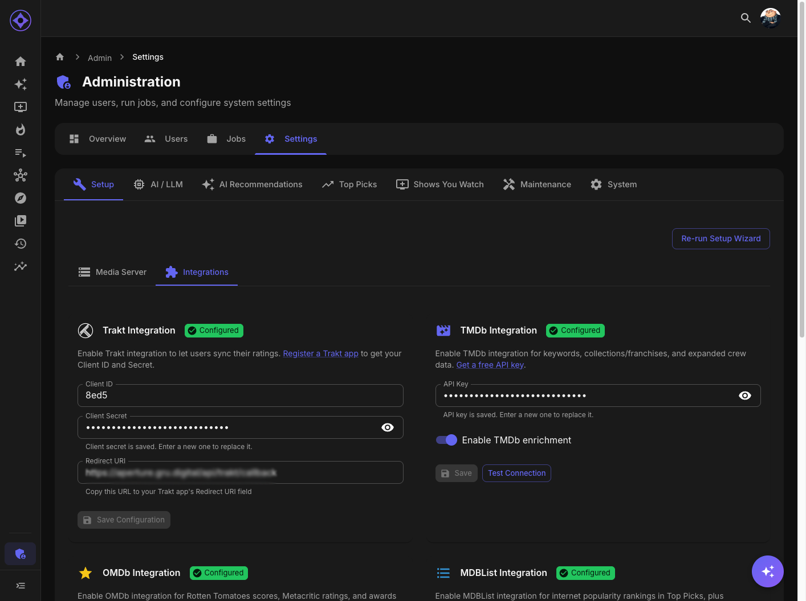

# MDBList Integration

Connect to MDBList for curated movie/TV lists and as a Top Picks popularity source.

## Accessing Settings

Navigate to **Admin → Settings → Setup → Integrations**

---

## What MDBList Provides

| Feature | Description |
|---------|-------------|
| **Curated Lists** | Community-created movie/TV lists |
| **Top Picks Source** | Use MDBList rankings for Top Picks |
| **Multiple Scores** | Aggregated ratings from multiple sources |
| **Genre Lists** | Pre-built genre-specific collections |

---

## Use Cases

### Top Picks

Use MDBList as the popularity source for Top Picks:
- "Most Popular Movies" list
- "Trending This Week" list
- Custom curated list

### Discovery

MDBList can provide additional Discovery suggestions.

### Enrichment

The `enrich-mdblist` job adds MDBList scores to your content.

---

## Getting an API Key

1. Create account at [mdblist.com](https://mdblist.com/)
2. Go to your profile/settings
3. Find or generate your API key
4. Copy the key

### Account Tiers

| Tier | Features |
|------|----------|
| **Free** | Limited API calls, public lists |
| **Supporter** | More calls, private lists |
| **Pro** | Unlimited, priority support |

---

## Configuration

1. Navigate to Admin → Settings → Setup → Integrations
2. Find MDBList section
3. Enter your **API Key**
4. Click **Test Connection**
5. Click **Save**

---

## Using MDBList for Top Picks

See [Top Picks Configuration](top-picks.md) for full details.

### Quick Setup

1. Go to Admin → Settings → Top Picks
2. Set **Popularity Source** to "MDBList"
3. Click **Select List**
4. Browse or search for a list
5. Select your preferred list
6. Configure sort order
7. Save and run Top Picks job

### Popular Lists

| List Type | Good For |
|-----------|----------|
| "Most Popular Movies" | General trending |
| "Best of 2024" | Recent quality |
| "IMDb Top 250" | All-time classics |
| Genre-specific | Targeted collections |

---

## List Selection

### Browsing Lists

The MDBList selector shows:
- Popular public lists
- Your own lists (if logged in)
- Search functionality

### List Information

Each list displays:
- List name and description
- Item count
- Last updated date
- Author

### Library Match Preview

After selecting a list:
- Shows how many items match your library
- Lists missing items
- Helps choose appropriate lists

---

## Sort Options

When using MDBList for Top Picks:

| Sort Option | Description |
|-------------|-------------|
| **MDBList Score** | Combined score from all sources |
| **Average Score** | Simple average |
| **IMDb Rating** | IMDb user rating |
| **IMDb Votes** | Number of votes |
| **IMDb Popularity** | IMDb popularity rank |
| **TMDb Popularity** | TMDb popularity score |
| **Rotten Tomatoes** | RT critic score |
| **Metacritic** | Metacritic score |

---

## Enrichment Job

The `enrich-mdblist` job fetches additional data:

### What It Adds

- MDBList combined score
- Streaming availability
- Additional ratings

### Running

- **Automatic:** Part of enrichment cycle
- **Manual:** Admin → Jobs → enrich-mdblist → Run

---

## Hybrid Mode

Combine MDBList with local watch data:

### Configuration

1. Set Top Picks source to "Hybrid"
2. Configure MDBList list as above
3. Set weights:
   - **Local Weight:** How much server data matters
   - **MDBList Weight:** How much list ranking matters

### How It Works

Final score = (Local popularity × Local weight) + (MDBList position × MDBList weight)

---

## Troubleshooting

### "Invalid API key"

- Verify key is correct
- Check account is active
- Ensure no extra spaces in key

### List Not Loading

- Check API key has access to that list
- Verify list still exists
- Try searching by list ID directly

### Low Match Rate

If few list items match your library:
- List may contain content you don't have
- Consider different list
- Use Hybrid mode to supplement

---

## Privacy

### What's Shared

- API key for authentication
- List queries

### What's Not Shared

- Your library contents
- Your user data
- Watch history

---

**Previous:** [OMDb Integration](omdb.md) | **Next:** [Jellyseerr Integration](jellyseerr.md)
