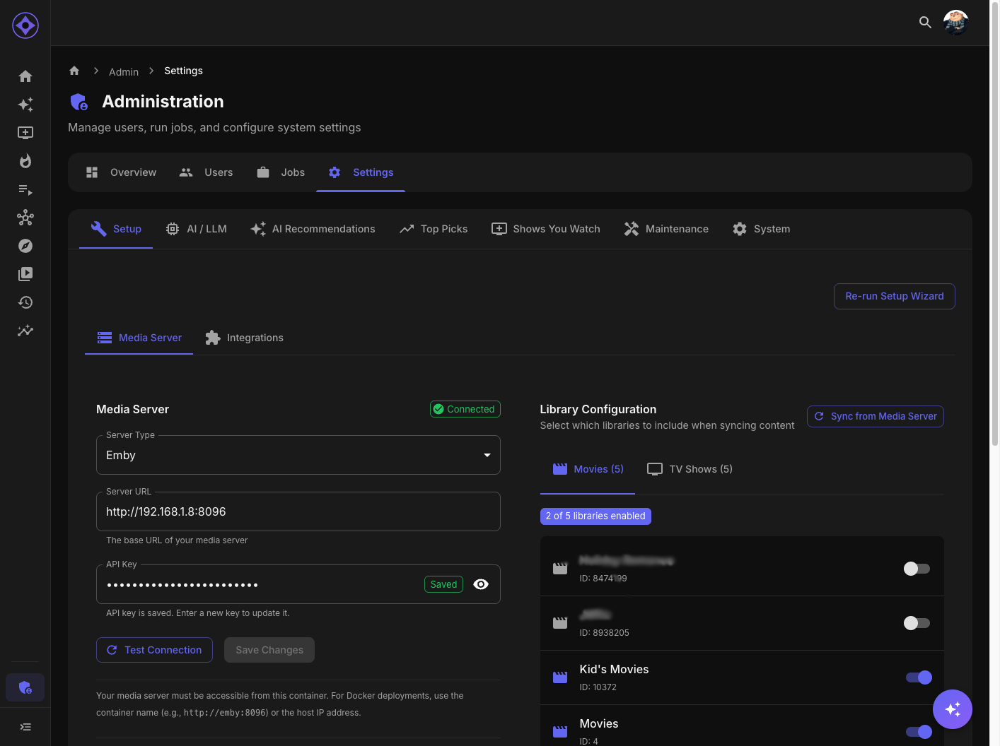

# Media Server Configuration

Configure the connection between Aperture and your Emby or Jellyfin server.



## Accessing Settings

Navigate to **Admin → Settings → Setup → Media Server**

---

## Server Configuration

### Server Type

| Type | Supported Versions |
|------|-------------------|
| **Emby** | Emby Server 4.7+ |
| **Jellyfin** | Jellyfin 10.8+ |

Select your server type from the dropdown.

### Server URL

Enter the full URL to your media server:

```
http://192.168.1.100:8096
```

**Include:**
- Protocol (`http://` or `https://`)
- IP address or hostname
- Port number

**Examples:**
| Setup | URL |
|-------|-----|
| Local HTTP | `http://192.168.1.100:8096` |
| Local HTTPS | `https://192.168.1.100:8920` |
| Domain | `https://emby.example.com` |
| Docker internal | `http://emby:8096` |

### API Key

An admin-level API key from your media server.

---

## Getting Your API Key

### Emby

1. Open Emby web interface
2. Click the **gear icon** (Settings)
3. Navigate to **Advanced → API Keys**
4. Click **+ New API Key**
5. Enter a name: "Aperture"
6. Click **OK**
7. Copy the generated key

### Jellyfin

1. Open Jellyfin web interface
2. Click **Dashboard** (admin menu)
3. Navigate to **API Keys**
4. Click **+** (Add)
5. Enter app name: "Aperture"
6. Click **OK**
7. Copy the generated key

---

## Testing Connection

After entering your configuration:

1. Click **Test Connection**
2. Wait for the test to complete

### Success Indicators

| Result | Meaning |
|--------|---------|
| ✓ Green checkmark | Connection successful |
| Server name shown | Correct server identified |
| Version displayed | API communication working |

### Failure Indicators

| Result | Likely Cause |
|--------|--------------|
| ✗ Red X | Connection failed |
| "Connection refused" | Wrong URL or port |
| "Unauthorized" | Invalid API key |
| "Timeout" | Network/firewall issue |

---

## Troubleshooting

### Connection Refused

**Check:**
- Server is running
- URL is correct (including port)
- No typos in the address
- Protocol matches (http vs https)

**Docker users:**
- Use container name if on same network: `http://emby:8096`
- Or use host IP, not `localhost`

### Unauthorized (401/403)

**Check:**
- API key is correct (no extra spaces)
- API key has admin privileges
- Key hasn't been revoked

**Regenerate key:**
1. Delete old key in media server
2. Create new key
3. Update in Aperture

### Timeout

**Check:**
- Firewall allows connection
- Server is accessible from Aperture container
- No network segmentation blocking traffic

**Test from container:**
```bash
docker exec aperture curl http://emby:8096/System/Info
```

### SSL Certificate Errors

**Options:**
- Use HTTP instead of HTTPS internally
- Add certificate to Aperture's trust store
- Use a valid SSL certificate

---

## Saving Configuration

1. Click **Save**
2. Configuration is stored in database
3. Aperture reconnects with new settings

### When to Re-configure

- Media server IP changed
- Migrated to new server
- Changed ports
- Renewed API key

---

## Multiple Media Servers

Currently, Aperture supports **one media server** at a time.

To switch servers:
1. Update URL and API key
2. Re-sync libraries
3. Re-import users
4. Regenerate recommendations

**Data impact:**
- Previous media server's data remains
- New server's content is added
- May cause duplicates if same content exists

---

## Security Considerations

### API Key Protection

- API key provides admin access
- Store securely
- Don't share in logs or screenshots
- Rotate periodically

### Network Security

| Setup | Recommendation |
|-------|----------------|
| Same host | Use localhost or container name |
| Same network | Use private IP |
| Remote | Use HTTPS with valid certificate |
| Public internet | Use VPN or reverse proxy with auth |

---

## Docker Networking

### Same Docker Network

If Aperture and Emby/Jellyfin are on the same Docker network:

```yaml
# docker-compose.yml
services:
  aperture:
    networks:
      - media
  emby:
    networks:
      - media

networks:
  media:
```

Use container name as hostname: `http://emby:8096`

### Different Networks

If on different networks or hosts:
- Use host IP address
- Ensure port is accessible
- Check firewall rules

---

**Previous:** [Post-Setup Checklist](post-setup-checklist.md) | **Next:** [Library Configuration](libraries.md)
