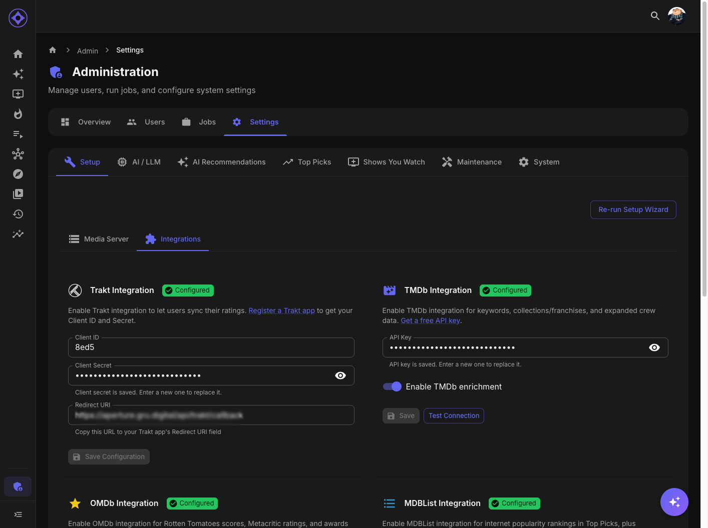

# Seerr Integration

Connect to Seerr (or Overseerr) to enable content requests from the Discovery page.

## Accessing Settings

Navigate to **Admin → Settings → Setup → Integrations**

---

## What Seerr Provides

| Feature | Description |
|---------|-------------|
| **Request Management** | Users can request content from Discovery |
| **Status Tracking** | Shows pending/approved/available status |
| **Availability Check** | Indicates if content is already available |
| **Download Tracking** | Shows when requested content arrives |

---

## Prerequisites

- Seerr or Overseerr installed and running
- API access enabled
- Users configured in Seerr

---

## Getting Your API Key

### Seerr

1. Open Seerr web interface
2. Go to **Settings → General**
3. Find **API Key** section
4. Click **View** or **Copy**

### Overseerr

1. Open Overseerr web interface
2. Go to **Settings → General**
3. Scroll to **API Key**
4. Copy the key

---

## Configuration

1. Navigate to Admin → Settings → Setup → Integrations
2. Find Seerr section
3. Enter:

| Field | Value |
|-------|-------|
| **URL** | Full Seerr URL (e.g., `http://192.168.1.100:5055`) |
| **API Key** | Your Seerr API key |

4. Click **Test Connection**
5. Click **Save**

---

## User Mapping

Seerr needs to map Aperture users to Seerr users:

### Automatic Mapping

If usernames match between:
- Aperture (from media server)
- Seerr

Users are mapped automatically.

### Manual Mapping

If usernames differ:
1. Users may need to link accounts manually
2. Or admin configures mapping in Seerr

---

## Discovery Integration

With Seerr configured:

### Request Button

Discovery cards show a **Request** button:
- Click to request content
- Status updates in real-time
- Appears on items not in library

### Request Status

| Status | Meaning | Badge Color |
|--------|---------|-------------|
| **Request** | Can be requested | Blue |
| **Pending** | Awaiting approval | Yellow |
| **Approved** | Request approved | Green |
| **Processing** | Being downloaded | Orange |
| **Available** | Downloaded and ready | Purple |
| **Declined** | Request denied | Red |

---

## Permissions

### Request Permissions

Control who can request:

| Level | Access |
|-------|--------|
| **Admin** | All requests |
| **User** | Based on Seerr quota |
| **Guest** | Usually no requests |

Configure in Seerr's user settings.

### Quota Management

Seerr can limit:
- Movies per week
- Series per week
- Total pending requests

---

## Request Flow

1. User finds content on Discovery page
2. Clicks **Request**
3. Request created in Seerr
4. Admin reviews (if auto-approve disabled)
5. Content downloads via Radarr/Sonarr
6. Appears in library
7. Available for recommendations

---

## Troubleshooting

### "Connection refused"

- Verify URL is correct
- Check Seerr is running
- Ensure port is accessible

### "Unauthorized"

- API key is invalid or expired
- Generate new key in Seerr
- Check key permissions

### Request Button Not Showing

- User may not have request permission
- User mapping may have failed
- Check Seerr user settings

### Requests Not Updating

- Check Seerr is processing requests
- Verify Radarr/Sonarr connection in Seerr
- Look for errors in Seerr logs

---

## Without Seerr

If not using Seerr:
- Discovery still works
- Shows "Not Available" instead of request button
- Users can manually request through other means

Discovery is fully functional without Seerr, just without the request workflow.

---

## Security

### API Key Protection

- Stored encrypted in database
- Not exposed in UI after saving
- Use dedicated API key

### Network Access

| Setup | Recommendation |
|-------|----------------|
| Same network | Use internal IP |
| Docker | Use container name |
| Remote | Use HTTPS |

---

**Previous:** [MDBList Integration](mdblist.md) | **Next:** [AI Providers](ai-providers.md)
