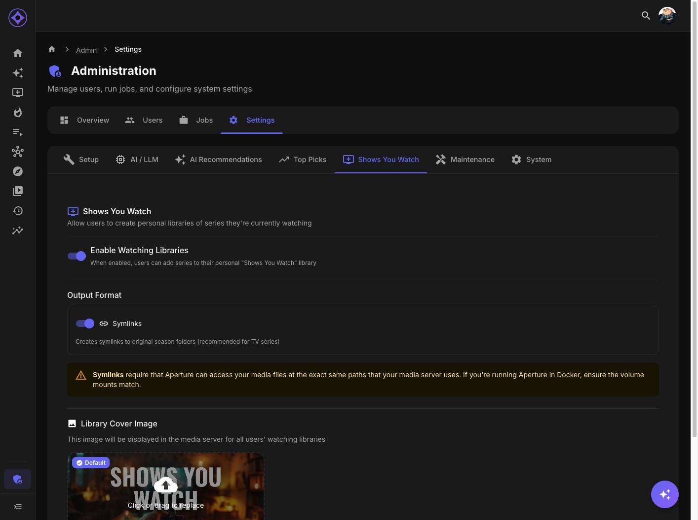

# Shows You Watch Configuration

Configure the automatic tracking of ongoing series users are watching.

## Accessing Settings

Navigate to **Admin → Settings → Shows You Watch**

---

## What Is Shows You Watch?

Automatically tracks TV series users are actively following:

| Feature | Description |
|---------|-------------|
| **Per-user** | Each user has their own list |
| **Automatic** | Populated from watch activity |
| **Continuing** | Only ongoing (not ended) series |
| **Upcoming** | Shows next episode information |

---

## How It Works

### Qualification Criteria

A series appears in Shows You Watch when:

1. User has watched recent episodes
2. Series status is "Continuing" (not ended)
3. Meets activity threshold

### Automatic Updates

Updates when:
- User watches new episodes
- Series status changes
- Episode air dates update
- Sync job runs

---

## Configuration

### Enable/Disable

| Setting | Effect |
|---------|--------|
| **Enabled** | Feature active for all users |
| **Disabled** | Feature hidden |

### Staleness Threshold

Days without watching before a series is removed:

| Setting | Effect |
|---------|--------|
| **30 days** | Aggressive cleanup |
| **60 days** | Moderate (default) |
| **90 days** | Keep longer |
| **Never** | Only remove ended series |

### Minimum Episodes

Episodes watched to qualify:

| Setting | Effect |
|---------|--------|
| **1** | Any watch qualifies |
| **2-3** | More commitment needed |
| **Full season** | Only dedicated viewers |

### Include Ended Series

Whether to show recently-ended series:

| Setting | Effect |
|---------|--------|
| **Yes** | Keep ended series temporarily |
| **No** | Remove immediately when ended |

---

## Library Output

### Enable Library

Create a virtual library in the media server:

| Setting | Effect |
|---------|--------|
| **Enabled** | Library created for each user |
| **Disabled** | Only visible in Aperture |

### Library Naming

Template: `Shows You Watch - {{username}}`

Users can customize in their settings.

### File Type

| Option | Best For |
|--------|----------|
| **STRM** | Universal compatibility |
| **Symlinks** | Same filesystem setups |

---

## User Features

### What Users See

In Aperture:
- List of tracked series
- Progress (episodes watched)
- Next episode info
- Days until next episode

In Media Server:
- Virtual library with tracked series
- Easy access from home screen

### Grid and List Views

Users can toggle between:
- **Grid View** — Poster cards
- **List View** — Detailed rows with upcoming info

---

## Sync Job

The `sync-watching-libraries` job:

### What It Does

1. Analyzes user watch history
2. Identifies qualifying series
3. Updates Shows You Watch lists
4. Creates/updates virtual libraries

### Schedule

Default: Daily

Configure in Admin → Jobs.

### Manual Run

Admin → Jobs → sync-watching-libraries → Run

---

## Episode Data

### Next Episode Information

Shows:
- Episode title
- Air date
- Days until airing
- Season/episode number

### Data Source

Episode air dates come from:
1. Your media server (if available)
2. TMDb enrichment
3. Trakt (if connected)

### Accuracy

Air date accuracy depends on:
- Metadata quality
- Enrichment completeness
- Series being tracked by metadata sources

---

## Troubleshooting

### Series Not Appearing

1. Check user has watched episodes
2. Verify series is "Continuing" status
3. Check staleness threshold
4. Run sync job manually

### Wrong Episode Shown

1. Verify episode metadata
2. Run enrichment jobs
3. Check air dates in media server

### Library Not Creating

1. Check library output is enabled
2. Verify path configuration
3. Check for file permission issues
4. Review job logs

---

## Privacy Considerations

Shows You Watch reveals viewing habits:
- What users are watching
- How current they are
- Viewing patterns

Libraries are per-user and only visible to that user (unless admin shares).

---

**Previous:** [Top Picks Configuration](top-picks.md) | **Next:** [Maintenance](maintenance.md)
