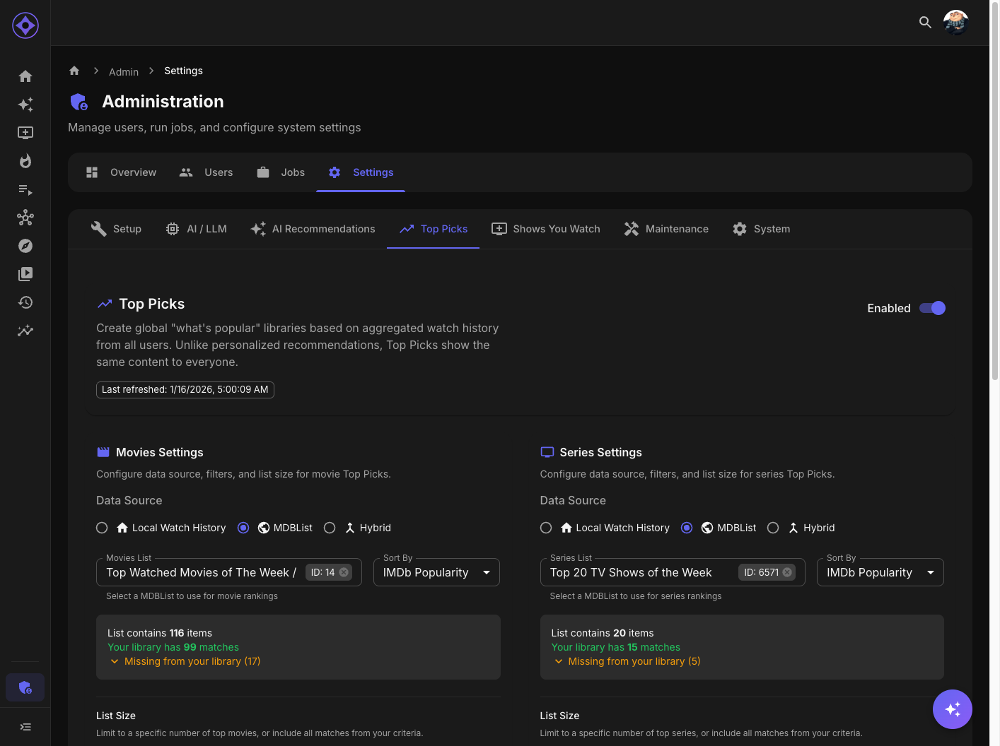

# Top Picks Configuration

Configure global trending content libraries based on watch activity or external rankings.

## Accessing Settings

Navigate to **Admin → Settings → Top Picks**

---

## What Is Top Picks?

Top Picks shows trending content across all users:

| Feature | Description |
|---------|-------------|
| **Global** | Same for all users (not personalized) |
| **Popularity-based** | Based on what's being watched |
| **Configurable source** | Local data, MDBList, or hybrid |

---

## Popularity Sources

### Local Watch Data

Rankings based on your server's actual viewing:

| Metric | Description |
|--------|-------------|
| **Unique Viewers** | Different users who watched |
| **Play Count** | Total plays across all users |
| **Completion Rate** | How often users finish |

### MDBList

External curated rankings:

| Option | Description |
|--------|-------------|
| Public lists | Community-created rankings |
| Private lists | Your own MDBList collections |
| Search | Find specific lists |

### Hybrid

Combine both sources:

| Setting | Description |
|---------|-------------|
| **Local Weight** | How much server data matters |
| **MDBList Weight** | How much list ranking matters |

---

## Local Mode Settings

### Time Window

How far back to analyze:

| Setting | Effect |
|---------|--------|
| **7 days** | This week's trending |
| **30 days** | This month's popular |
| **90 days** | Quarterly trends |
| **365 days** | Yearly popular |

### Minimum Viewers

Require minimum unique viewers:

| Setting | Effect |
|---------|--------|
| **1** | Any watched content |
| **2-3** | Content watched by multiple users |
| **5+** | Broadly popular only |

### Item Count

How many items in Top Picks:

| Setting | Typical Use |
|---------|-------------|
| **10** | Top 10 list |
| **25** | Focused selection |
| **50** | Full library |

### Scoring Weights

How metrics contribute (should sum to 1.0):

| Weight | Default | Description |
|--------|---------|-------------|
| **Unique Viewers** | 0.5 | Different people watching |
| **Play Count** | 0.3 | Total plays |
| **Completion Rate** | 0.2 | Finishing content |

---

## MDBList Mode Settings

### Selecting a List

1. Click **Select List**
2. Browse or search for lists
3. Preview matches against your library
4. Select and save

### Sort Options

| Option | Description |
|--------|-------------|
| **MDBList Score** | Combined rating |
| **Average Score** | Simple average |
| **IMDb Rating** | IMDb user rating |
| **IMDb Votes** | Number of votes |
| **IMDb Popularity** | Popularity rank |
| **TMDb Popularity** | TMDb score |
| **Rotten Tomatoes** | Critic score |
| **Metacritic** | Metacritic score |

### Library Match Preview

After selecting a list:
- Shows total items in list
- How many match your library
- Which items are missing

---

## Output Configuration

### Output Types

Choose how Top Picks appear (can enable multiple):

| Type | Description | Pros |
|------|-------------|------|
| **Library** | Virtual folder with STRM/symlinks | Full browsing |
| **Collection** | Box set in media server | Groups nicely |
| **Playlist** | Server playlist | Easy playback |

### Library File Type

When using Libraries:

| Option | Best For |
|--------|----------|
| **STRM** | Universal compatibility |
| **Symlinks** | Same filesystem setups |

### Naming

| Setting | Default |
|---------|---------|
| Movies Library | "Top Picks - Movies" |
| Series Library | "Top Picks - Series" |
| Collection | "Top Movies This Week" |
| Playlist | "Top Movies This Week" |

---

## Separate Movie/Series Config

Configure independently:

| Setting | Movies | Series |
|---------|--------|--------|
| Enabled | Yes/No | Yes/No |
| Source | Local/MDBList/Hybrid | Local/MDBList/Hybrid |
| Output Types | Library/Collection/Playlist | Library/Collection/Playlist |

---

## Refresh Schedule

### Automatic Refresh

Configure in Admin → Jobs:

| Schedule | Effect |
|----------|--------|
| **Daily** | Fresh picks each day |
| **Weekly** | Weekly updates |
| **Manual** | Only when triggered |

### Manual Refresh

Click **Refresh Top Picks Now** to update immediately.

---

## Rank Display

### In Libraries

Items show rank badges:
- 🥇 #1 (Gold)
- 🥈 #2 (Silver)
- 🥉 #3 (Bronze)
- 4+ numbered badges

### In Collections

Items sorted by sort name:
- "01 - Movie Title"
- "02 - Movie Title"
- Maintains rank order

---

## Viewer Statistics

Top Picks shows viewer data:

| Stat | Description |
|------|-------------|
| **Unique Viewers** | Users who watched |
| **Play Count** | Total plays |

This data comes from your server regardless of popularity source.

---

## Troubleshooting

### No Items Showing

1. Check Top Picks is enabled
2. Verify source is configured
3. Run `refresh-top-picks` job
4. Check library match (for MDBList)

### Wrong Items

1. Review source configuration
2. Check time window setting
3. Verify minimum viewers threshold
4. Check sort order

### Viewer Stats Show Zero

- Run watch history sync jobs
- Verify users have watch history
- Check MDBList mode includes local stats

---

**Previous:** [Algorithm Tuning](algorithm-tuning.md) | **Next:** [Shows You Watch Configuration](shows-you-watch.md)
