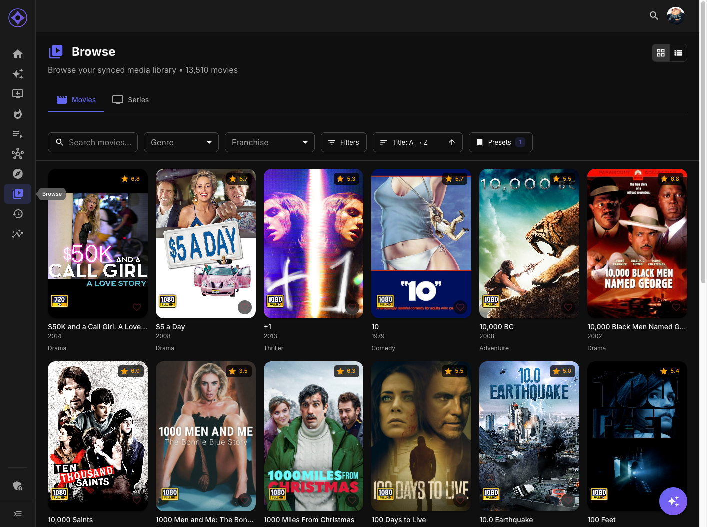
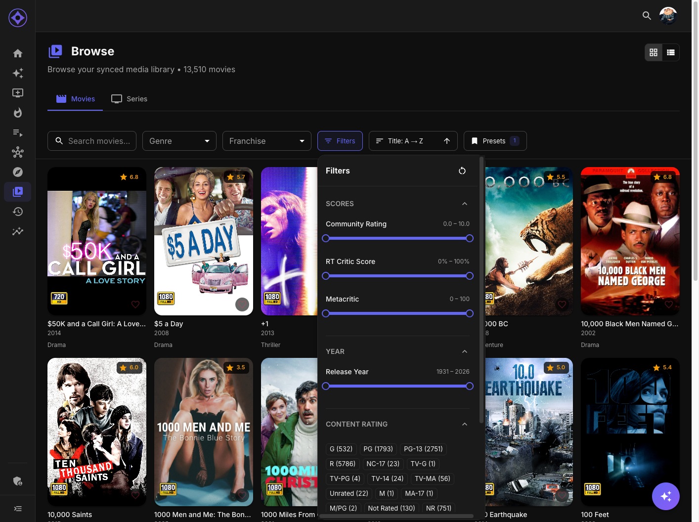
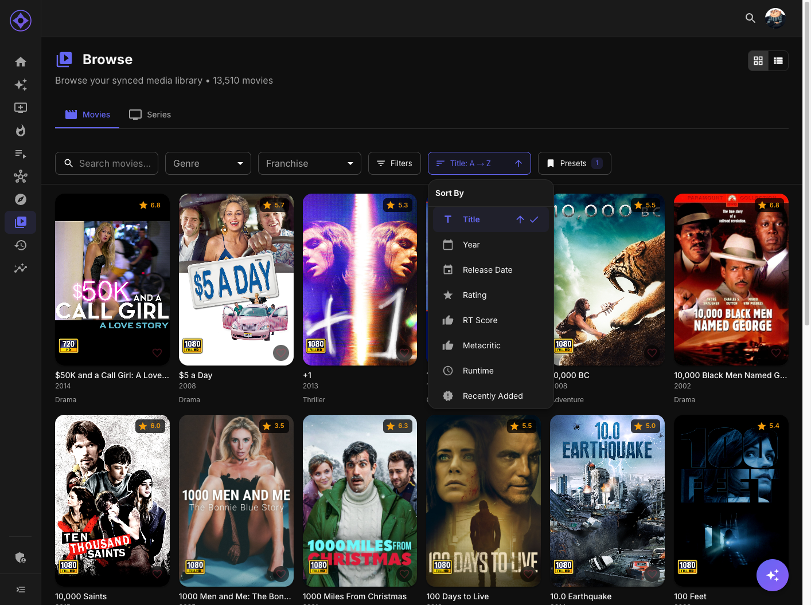

# Browse Movies & Series

The Browse page is your library explorer with powerful filtering, sorting, and organization tools.

## Page Layout

### Tabs

Switch between content types using the tabs at the top:

- **Movies** — Browse your movie library
- **Series** — Browse your TV series library

Each tab maintains its own filters, sort preferences, and view mode.

### View Modes

Toggle between two display modes using the buttons in the header:

| Mode | Description |
|------|-------------|
| **Grid View** | Poster grid with quick info on hover |
| **List View** | Detailed rows with metadata, ratings, and synopsis |

Your preferred view mode is **saved per page** and remembered when you return.

---

## Filtering Content

### Quick Filters

The filter bar contains quick-access filters:

| Filter | Movies | Series |
|--------|--------|--------|
| **Search** | Search by title | Search by title |
| **Genre** | Filter by genre | Filter by genre |
| **Franchise** | Filter by collection | — |
| **Network** | — | Filter by TV network |

### Advanced Filters

Click the **Filters** button to open the advanced filter panel:

#### For Movies

| Filter | Description |
|--------|-------------|
| **Year Range** | Slider for release year (e.g., 1990-2020) |
| **Runtime** | Slider for duration in minutes |
| **Community Rating** | Minimum rating threshold |
| **Rotten Tomatoes** | Minimum RT critic score |
| **Metacritic** | Minimum Metacritic score |
| **Content Rating** | Select ratings (G, PG, PG-13, R, etc.) |
| **Resolution** | Select quality (4K, 1080p, 720p, SD) |

#### For Series

| Filter | Description |
|--------|-------------|
| **Year Range** | Slider for premiere year |
| **Seasons** | Slider for number of seasons |
| **Community Rating** | Minimum rating threshold |
| **Rotten Tomatoes** | Minimum RT critic score |
| **Metacritic** | Minimum Metacritic score |
| **Content Rating** | Select ratings |
| **Status** | Filter by Continuing, Ended, etc. |

### Active Filters

When filters are active:

- A badge shows the count of active filters
- Filter chips appear below the filter bar
- Click the **X** on any chip to remove that filter
- Click **Clear All** to reset all filters

---

## Sorting

Click the **Sort** button to change the sort order:

### Sort Options

| Option | Description |
|--------|-------------|
| **Title** | Alphabetical A-Z or Z-A |
| **Year** | By release/premiere year |
| **Release Date** | By exact release date (movies) |
| **Rating** | By community rating |
| **RT Score** | By Rotten Tomatoes score |
| **Metacritic** | By Metacritic score |
| **Runtime** | By duration (movies) |
| **Seasons** | By number of seasons (series) |
| **Date Added** | By when added to library |

### Sort Order

Click the same sort option again to toggle between:

- **Ascending** (↑) — A-Z, lowest first, oldest first
- **Descending** (↓) — Z-A, highest first, newest first

### Sort Persistence

Your sort preference is **automatically saved** per media type:

- Movies and Series have independent sort settings
- Settings sync to your account (work across devices)
- Persists between sessions

---

## Filter Presets

Save your favorite filter combinations for quick access.

### Saving a Preset

1. Set up your desired filters
2. Click the **Presets** button
3. Click **Save Current Filters**
4. Enter a name (e.g., "High Rated Action", "90s Comedies")
5. Click **Save**

### Loading a Preset

1. Click the **Presets** button
2. Click on any saved preset
3. All filters from that preset are applied

### Managing Presets

- **Rename** — Click the menu icon on a preset, select Rename
- **Delete** — Click the menu icon, select Delete
- **Manage All** — Click "Manage Presets" to see all presets

### Preset Scope

- Presets are saved separately for Movies vs Series
- Each preset stores: genre, franchise/network, and all advanced filters
- Presets sync to your account

---

## Sticky Filter Bar

When you scroll down, the filter bar **sticks to the top** of the page:

- Filters remain accessible while browsing
- Active filter chips stay visible
- Easy to adjust filters without scrolling back up

---

## Infinite Scroll

Content loads automatically as you scroll:

- Initial load shows first batch of results
- Scroll to bottom to load more
- Total count shown in header
- Loading indicator appears while fetching

---

## Rating from Browse

In both Grid and List views:

- **Grid View** — Hover to reveal the heart rating overlay
- **List View** — Heart rating appears inline with each item

Click the heart to rate any item without leaving the page.

---

## Tips

- Use **filter presets** to quickly switch between browsing modes
- **List view** shows more metadata for informed decisions
- Combine **multiple filters** to narrow down large libraries
- **Sort by Date Added** to find your newest content

---

**Next:** [Movie Details](movie-detail.md)
