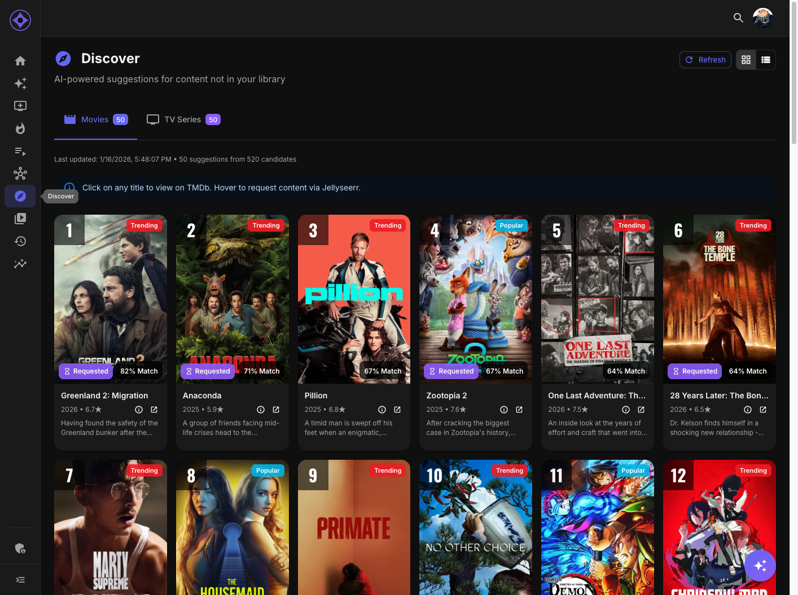

# Discovery

Discovery helps you find movies and TV series that aren't in your library yet, with AI-powered suggestions and optional Jellyseerr integration for requesting content.

## Accessing Discovery

Navigate to **Discover** in the sidebar (compass icon).

**Note:** Your admin must enable Discovery for your account.

---

## Page Layout

### Tabs

Switch between content types:

- **Movies** — Movie suggestions
- **Series** — TV series suggestions

### View Modes

Toggle between display modes:

| Mode | Description |
|------|-------------|
| **Grid View** | Poster cards with source badges |
| **List View** | Detailed rows with metadata and scores |

---

## Discovery Cards

Each suggestion shows:

### Poster Card

| Element | Description |
|---------|-------------|
| **Poster** | Movie/series artwork |
| **Rank Badge** | Top-left: 🥇🥈🥉 for top 3 |
| **Source Badge** | Top-right: Where suggestion came from |
| **Match %** | Bottom-right: AI confidence |
| **Request Status** | Bottom-left: Jellyseerr status (if applicable) |

### List View

Additional details shown:

- Full metadata (year, runtime, genres)
- Synopsis/overview
- Cast highlights
- Score breakdown

---

## Suggestion Sources

Discovery pulls candidates from multiple sources:

### TMDb (The Movie Database)

| Source | Description |
|--------|-------------|
| **Recommendations** | Based on content you've watched |
| **Similar** | Based on content you've rated highly |
| **Discover** | Popular/trending meeting quality thresholds |

### Trakt (if connected)

| Source | Description |
|--------|-------------|
| **Trending** | Currently hot content |
| **Popular** | All-time popular |
| **Personal** | Personalized Trakt recommendations |

Source badges show where each suggestion originated.

---

## AI Scoring

Each candidate is scored with weighted factors:

| Factor | Weight | Description |
|--------|--------|-------------|
| **Similarity** | 50% | Match to your taste profile |
| **Popularity** | 30% | General audience appeal |
| **Recency** | 20% | Bonus for newer releases |

The final match percentage reflects the combined score.

---

## Detail View

Click the **info icon** on any card to see:

### Full Metadata

- Title (and original title if different)
- Year, runtime, rating
- Genres
- Vote count

### Backdrop

Full-width fanart image.

### Cast & Crew

- Top 8 cast members with photos
- Director/creator information
- Click names to learn more

### Score Breakdown

- AI match percentage
- Similarity score details

---

## Requesting Content

If your admin has configured Jellyseerr:

### Making a Request

1. Hover over a Discovery card
2. Click **Request**
3. Confirm the request
4. Status badge appears on the card

### Request Statuses

| Status | Badge | Meaning |
|--------|-------|---------|
| **Pending** | Yellow | Awaiting admin approval |
| **Approved** | Green | Request approved |
| **Declined** | Red | Request denied |
| **Available** | Blue | Downloaded and ready |

### Permissions

Your admin controls:

- Whether you can see Discovery suggestions
- Whether you can submit requests

If you don't see the Request button, you may not have request permissions.

---

## Refreshing Suggestions

### Automatic

Discovery runs on a schedule (typically daily) to generate fresh suggestions.

### Manual Refresh

Click the **Refresh** button to regenerate suggestions:

- Fetches new candidates from sources
- Re-scores based on your latest activity
- Updates the display

**Note:** Manual refresh may take a moment while candidates are fetched and scored.

---

## Filtering

Discovery results are already filtered to exclude:

- Content already in your library
- Content you've watched (even if not in library)
- Previously declined requests

This ensures you only see truly new suggestions.

---

## Tips

### Improving Discovery

- Rate more content (affects similarity scoring)
- Connect Trakt for personalized Trakt recommendations
- Watch diverse content for broader suggestions

### Using Effectively

- Check regularly for new suggestions
- Use requests strategically for most-wanted content
- Combine with Explore for deeper discovery

---

**Next:** [Explore](explore.md)
