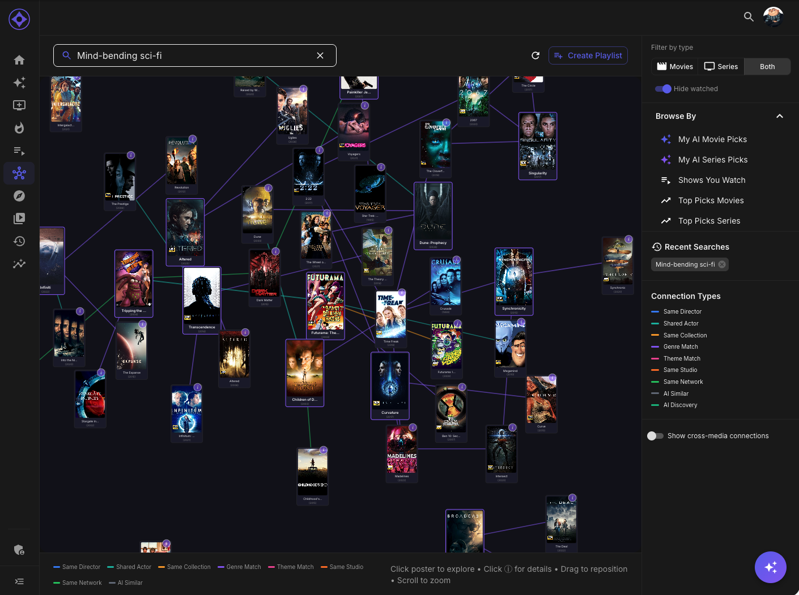

# Explore

Explore is an AI-powered semantic graph that lets you discover content through visual connections and relationships.

## Accessing Explore

Navigate to **Explore** in the sidebar (hub icon).

**Note:** Explore requires AI embeddings to be generated. Your admin must have completed the AI setup.

---

## The Graph Interface

### Visual Layout

- **Nodes** — Movie/series posters arranged in a network
- **Edges** — Lines connecting related content
- **Center** — Your current focus item
- **Surrounding** — Related items arranged by similarity

### Color-Coded Connections

| Color | Connection Type |
|-------|-----------------|
| **Blue** | Actor/cast shared |
| **Green** | Director/creator shared |
| **Orange** | Genre similarity |
| **Purple** | Thematic similarity |
| **Gray** | General embedding similarity |

---

## Navigation

### Starting Point

1. **Search** — Type a title to seed the graph
2. **Click any node** — Make it the new center
3. **From elsewhere** — Click "Explore Similar" on any detail page

### Drilling Down

1. Click a poster node
2. That item becomes the new center
3. New related items appear around it
4. Previous path shown in breadcrumbs

### Breadcrumb Trail

Shows your navigation path:

> Home → The Matrix → Inception → Interstellar

Click any breadcrumb to jump back to that point.

### Going Back

- Click breadcrumbs to revisit
- Use browser back button
- Click "Start Over" to reset

---

## Controls

### Hide Watched

Toggle to hide content you've already watched:

- **On** — Only shows unwatched content
- **Off** — Shows all related content

Useful for finding new things vs understanding connections.

### Primary Node Highlighting

The current center node is highlighted with:

- Larger size
- Glowing border
- Clear visual distinction

### Zoom & Pan

- **Scroll** — Zoom in/out
- **Drag** — Pan the canvas
- **Double-click** — Reset view

---

## Node Information

### Hover

Hover over any node to see:

- Title and year
- Rating
- Brief description
- Connection reason

### Click

Click a node to:

- Make it the new center
- Expand its connections
- See full details in sidebar

### Detail Panel

When a node is selected, a panel shows:

- Full poster
- Complete metadata
- Genres
- Your rating (with ability to rate)
- "View Details" link to full page

---

## Building Playlists

Create playlists from your exploration:

### From Exploration

1. Click **Start Playlist** button
2. Click nodes to add them
3. Items appear in playlist builder
4. Name and save your playlist

### Automatic Suggestions

The graph can suggest playlist themes:

- "Christopher Nolan Journey"
- "Mind-Bending Sci-Fi"
- "90s Action Classics"

Based on your selected nodes and their connections.

---

## Connection Types

### Shared Cast

Blue edges indicate shared actors:

> The Matrix ↔ John Wick (Keanu Reeves)

Click the edge to see who's shared.

### Shared Creator

Green edges indicate shared directors/creators:

> Inception ↔ Interstellar (Christopher Nolan)

### Genre Overlap

Orange edges indicate genre similarity:

> Both are sci-fi thrillers with similar themes

### Semantic Similarity

Purple edges indicate deeper thematic connections:

> Both explore themes of memory and identity

These use AI embeddings to find non-obvious connections.

---

## Using Explore Effectively

### Discovery Mode

1. Start with something you love
2. Navigate through connections
3. Find hidden gems related to your favorites

### Understanding Your Taste

1. See why items are connected
2. Notice patterns in what you like
3. Understand the common threads

### Building Collections

1. Explore a genre or theme
2. Add interesting finds to a playlist
3. Create curated viewing journeys

### Finding Specific Content

1. Search for a known title
2. Explore what's similar
3. Find the perfect movie for tonight

---

## Graph vs List Views

| Aspect | Graph (Explore) | List (Similarity) |
|--------|-----------------|-------------------|
| **Best For** | Discovery, exploration | Quick comparison |
| **Shows** | Network of connections | Ranked list |
| **Navigation** | Click to drill down | Scroll through |
| **Visual** | Spatial relationships | Linear ranking |

Use both as needed. Graph for discovery, list for picking from options.

---

**Next:** [Similarity Graphs](similarity-graphs.md)
