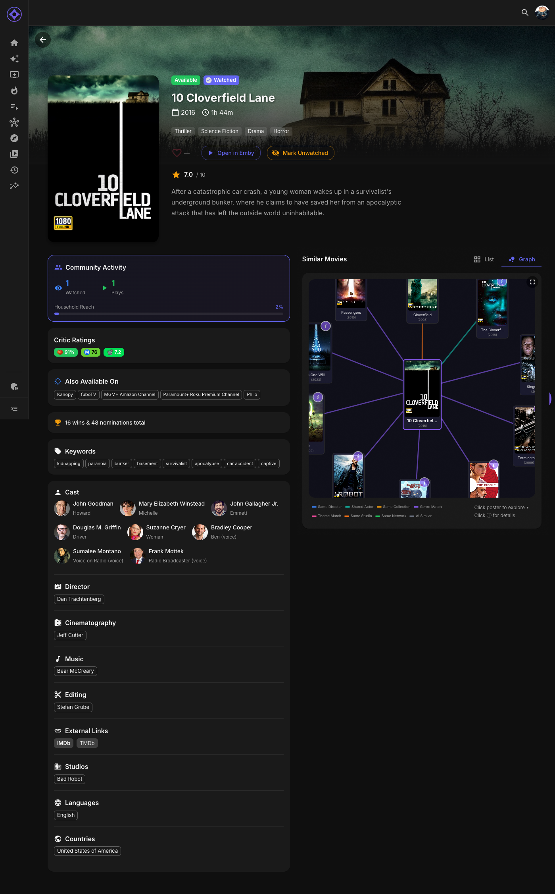

# Person Pages

Person pages show filmographies for actors, directors, writers, and other crew members.

## Accessing Person Pages

Multiple ways to reach a person page:

1. **Click a name** — From any movie or series detail page
2. **Search** — Type the person's name in global search
3. **Watch Stats** — Click from Top Actors or Top Directors
4. **Direct URL** — `/person/Person%20Name`

---

## Page Layout

### Header

- **Profile photo** — The person's image
- **Name** — Full name
- **Known for** — Primary profession (Actor, Director, etc.)
- **Birth/Death** — Dates if available

### Biography

If available, a brief biography of the person.

---

## Filmography

### Movies

All movies in your library featuring this person:

| Column | Description |
|--------|-------------|
| **Poster** | Movie thumbnail |
| **Title** | Click to view details |
| **Year** | Release year |
| **Role** | Their role (if actor) or job (director, writer) |
| **Your Rating** | Heart rating if rated |
| **Watch Status** | Whether you've seen it |

### TV Series

All series in your library featuring this person:

| Column | Description |
|--------|-------------|
| **Poster** | Series thumbnail |
| **Title** | Click to view details |
| **Years** | Run period |
| **Role** | Character name or job |
| **Episodes** | Number of episodes (for actors) |
| **Watch Status** | Your progress |

---

## Sorting & Filtering

### Sort Options

| Option | Description |
|--------|-------------|
| **Year** | By release/premiere date |
| **Rating** | By community rating |
| **Your Rating** | By your personal ratings |
| **Title** | Alphabetical |

### Filter Options

- **Watched only** — Show only what you've seen
- **Unwatched only** — Show what you haven't seen
- **Movies / Series** — Filter by content type

---

## Person Stats

Quick stats about this person in your library:

| Stat | Description |
|------|-------------|
| **Total Items** | Movies + series in your library |
| **Watched** | How many you've seen |
| **Avg Rating** | Your average rating of their work |
| **Your Favorite** | Highest-rated by you |

---

## Using Person Pages

### Discover New Content

- Found an actor you like? See what else they're in
- Enjoyed a director's film? Explore their catalog
- Writers often have consistent styles worth following

### Complete Filmographies

- See gaps in your viewing of a favorite actor
- Track how many of a director's films you've seen
- Discover hidden gems you didn't know they made

### Rate & Compare

- Rate items directly from the filmography
- Compare your ratings to community ratings
- Identify patterns in what you like from them

---

## Related People

At the bottom, you may see:

- **Frequent collaborators** — People they often work with
- **Similar actors** — Actors with overlapping filmographies
- **Same genre specialists** — Others known for similar content

---

**Next:** [Studio Pages](studio-pages.md)
