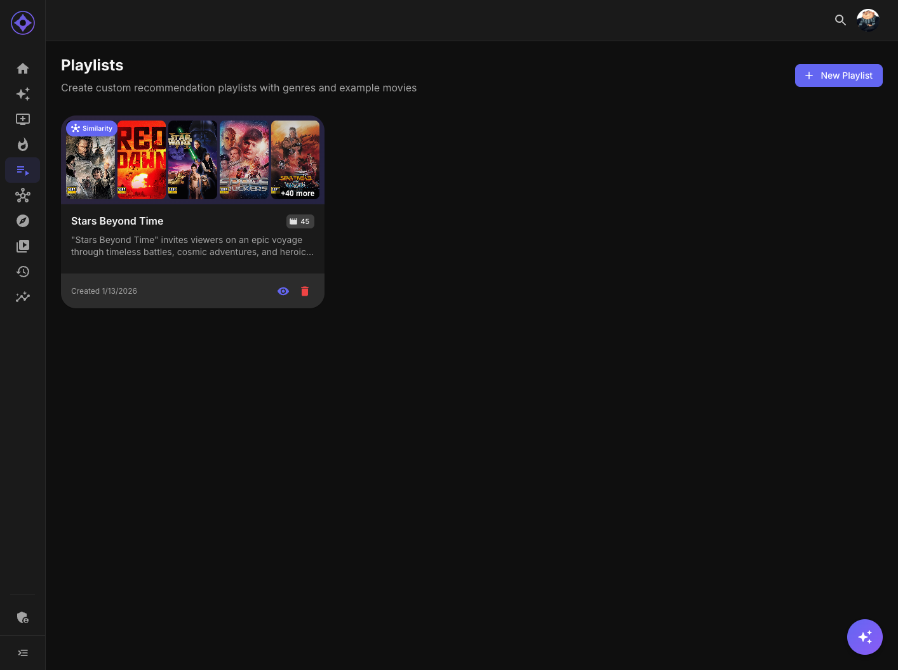

# Playlists

Playlists allow you to create custom collections of movies and series for organization and tracking.

## Accessing Playlists

Navigate to **Playlists** in the sidebar (playlist icon).

---

## Playlist Types

### Manual Playlists

Collections you create manually:

- Add specific movies/series
- Order them as you like
- Perfect for themed collections

**Examples:**
- "Date Night Movies"
- "Halloween Watchlist"
- "Shows to Watch with Mom"

### Graph Playlists

AI-generated playlists based on exploration:

- Created from Explore graph navigation
- Automatically themed
- AI-generated names and descriptions

**Examples:**
- "Mind-Bending Sci-Fi Journey"
- "Christopher Nolan's Best"
- "90s Nostalgia Trip"

---

## Playlist Cards

### Visual Design

Each playlist card shows:

| Element | Description |
|---------|-------------|
| **Poster Collage** | Preview of up to 4 items in the playlist |
| **Title** | Playlist name |
| **Count** | Number of items |
| **Type Badge** | Manual or Graph |
| **Description** | First line of description |

### Hover Actions

Hover over a card to see:

- **View** — Open the playlist
- **Edit** — Modify the playlist
- **Delete** — Remove the playlist

---

## Creating Playlists

### Manual Creation

1. Click **New Playlist** button
2. Enter a name
3. Optionally add a description
4. Click **Create**
5. Add items from browse/search

### From Explore

1. Navigate in the Explore graph
2. Click **Create Playlist** when you find interesting items
3. Selected nodes become playlist items
4. AI generates name and description

### AI-Assisted Creation

When creating a playlist:

1. Add items
2. Click **Generate Name** — AI suggests a title
3. Click **Generate Description** — AI writes a summary

---

## Managing Playlists

### Adding Items

Multiple ways to add content:

| Method | Steps |
|--------|-------|
| **From playlist** | Edit → Search → Add |
| **From browse** | Click "Add to playlist" on any poster |
| **From detail page** | Click "Add to playlist" button |
| **From search** | Add from search results |

### Reordering Items

In edit mode:

- Drag and drop items
- Items maintain their order

### Removing Items

- Click the **X** on any item to remove
- Or select multiple and bulk remove

### Editing Details

- **Rename** — Click the title to edit
- **Description** — Click to edit the description
- **Cover** — Changes based on items (auto-generated)

---

## Viewing Playlists

### Grid View

Click a playlist to see all items in a grid:

- Full posters
- Titles and years
- Your ratings
- Watch status

---

## Graph Playlists

### How They're Created

1. Navigate in Explore
2. System tracks your path
3. Click "Save as Playlist"
4. AI analyzes the connections
5. Generates themed name/description

### AI-Generated Content

The AI considers:

- Genres of selected items
- Shared actors/directors
- Themes and connections
- Your navigation pattern

**Example output:**

> **"Neo-Noir Mind Games"**
> *A curated journey through psychological thrillers that blur the line between reality and perception, featuring complex protagonists and twist endings.*

### Editing Graph Playlists

Graph playlists can be edited like manual ones:

- Add or remove items
- Reorder content
- Edit name/description

---

## Playlist Ideas

| Theme | Contents |
|-------|----------|
| **Award Season** | Oscar nominees/winners |
| **Comfort Rewatches** | Your 10/10 rated items |
| **Director Focus** | All films by one director |
| **Franchise Marathon** | Complete series in order |
| **Decade Collection** | Best of the 90s |
| **Guest Picks** | Crowd-pleasers for visitors |

---

## Tips

### Organization

- Use descriptive names
- Add descriptions for future reference
- Group related content together

### Maintenance

- Review playlists periodically
- Remove watched items if desired
- Update seasonal playlists

---

**Next:** [Virtual Libraries](virtual-libraries.md)
