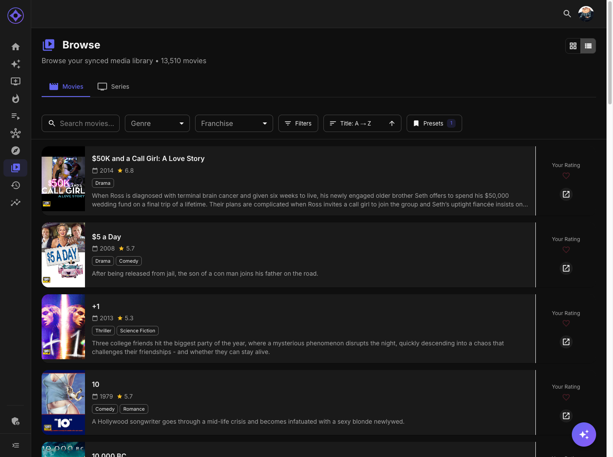

# The Rating System

Aperture uses a 10-heart rating system that's compatible with Trakt.tv and influences your AI recommendations.

## How Ratings Work

### The 10-Heart Scale

| Hearts | Meaning |
|--------|---------|
| ❤️ 1 | Terrible |
| ❤️❤️ 2 | Very Bad |
| ❤️❤️❤️ 3 | Bad |
| ❤️❤️❤️❤️ 4 | Poor |
| ❤️❤️❤️❤️❤️ 5 | Average |
| ❤️❤️❤️❤️❤️❤️ 6 | Fair |
| ❤️❤️❤️❤️❤️❤️❤️ 7 | Good |
| ❤️❤️❤️❤️❤️❤️❤️❤️ 8 | Great |
| ❤️❤️❤️❤️❤️❤️❤️❤️❤️ 9 | Excellent |
| ❤️❤️❤️❤️❤️❤️❤️❤️❤️❤️ 10 | Perfect |

---

## Where to Rate

### From Posters

Every poster displays a heart icon:

1. **Hover** over any poster (or tap on mobile)
2. **Click the heart** — A popper opens with 10 hearts
3. **Select your rating** — Click any heart (1-10)
4. **Done** — The heart fills to show your rating

Works on:
- Dashboard carousels
- Browse pages
- Recommendations
- Watch History
- Search results
- Playlists

### From Detail Pages

On movie and series detail pages:

1. Find the **rating section**
2. Click the large heart display
3. Select your rating

### From List Views

In list view mode:

- Heart rating appears inline with each item
- Click to rate without opening details

---

## Visual Feedback

### Single Heart Display

On posters, a single heart shows your rating:

| Fill Level | Meaning |
|------------|---------|
| Empty | Not rated |
| 10% filled | 1 heart |
| 50% filled | 5 hearts |
| 100% filled | 10 hearts |

The fill is proportional to your rating.

### Full Heart Display

In poppers and detail pages, all 10 hearts show:

- Filled hearts = your rating
- Empty hearts = remaining

---

## How Ratings Affect Recommendations

### High Ratings (7-10 hearts)

Items you rate highly influence recommendations positively:

- Similar content is boosted
- Shared genres get more weight
- Directors/actors are favored
- Franchises are considered

### Low Ratings (1-3 hearts)

Items you rate poorly affect recommendations based on your settings:

#### Exclude Mode (Default)

- Content similar to disliked items is **excluded**
- Helps avoid genres/styles you don't enjoy
- More aggressive filtering

#### Penalize Mode

- Content similar to disliked items is **deprioritized**
- May still appear, just ranked lower
- Less aggressive, more diverse results

Configure this in [Preferences Settings](user-settings/preferences.md).

### Neutral Ratings (4-6 hearts)

Middle ratings have minimal impact:

- Content is neither boosted nor penalized
- Useful for "it was fine" feelings
- Keeps recommendations balanced

---

## Rating Tips

### Be Consistent

- Use the full scale, not just 1 and 10
- A 7 should always mean the same thing to you
- Consistency improves recommendation accuracy

### Rate What You've Watched

- Rate items from your watch history
- The AI learns from rated items
- Unrated items are weighted less

### Don't Over-Rate

- Not everything needs a 10
- Reserve top ratings for truly exceptional content
- Helps the AI distinguish your real favorites

### Rate Both Likes and Dislikes

- Low ratings are valuable data
- Tell the AI what to avoid
- Improves filtering accuracy

---

## Removing Ratings

To remove a rating:

1. Click the heart
2. Click your current rating again (to deselect)
3. Or click the X/clear button if available

The item becomes unrated.

---

## Trakt Sync

If you've connected Trakt (see [Trakt Integration](trakt-integration.md)):

- Ratings sync bidirectionally
- Rate in Aperture → pushes to Trakt
- Rate in Trakt → syncs to Aperture
- Uses the same 10-point scale

---

## Recent Ratings

View your rating history:

1. **Dashboard** — Recent Ratings section
2. **Watch Stats** — Ratings distribution chart

Each shows:
- Item poster and title
- Your rating
- When you rated it

---

**Next:** [Your AI Picks](recommendations.md)
