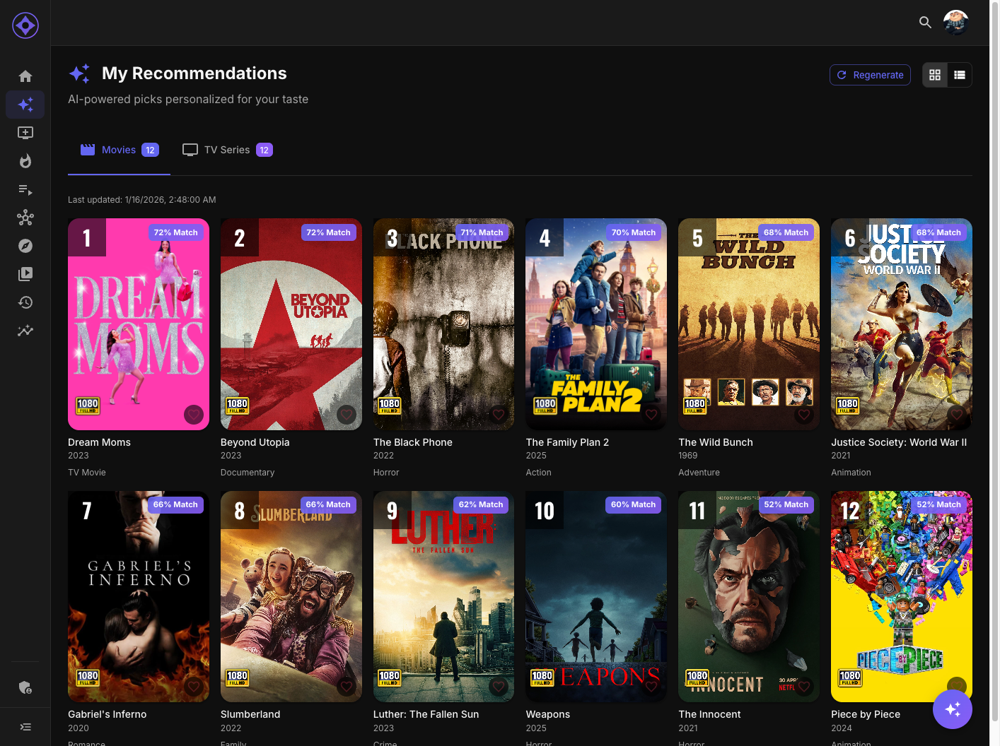

# Your AI Picks

The Recommendations page shows AI-generated personalized suggestions based on your watch history and ratings.

## Accessing Recommendations

Navigate to **Recommendations** in the sidebar (sparkle icon).

---

## Page Layout

### Tabs

Switch between content types:

- **Movies** — AI movie recommendations
- **Series** — AI series recommendations

### View Modes

Toggle between display modes:

| Mode | Description |
|------|-------------|
| **Grid View** | Poster grid with rank badges |
| **List View** | Detailed rows with match scores |

---

## Recommendation Display

### Rank Badges

Top recommendations show medal badges:

| Badge | Meaning |
|-------|---------|
| 🥇 Gold | #1 recommendation |
| 🥈 Silver | #2 recommendation |
| 🥉 Bronze | #3 recommendation |
| 4-50 | Numbered badge |

### Match Score

Each recommendation shows:

- **Percentage** — Overall match to your taste (e.g., 87%)
- **Visual bar** — Filled portion represents strength

---

## Understanding Recommendations

### Why This Pick?

Click any recommendation to see detailed insights:

#### Match Score Breakdown

| Factor | What It Measures |
|--------|------------------|
| **Taste Match** | Similarity to content you've enjoyed |
| **Discovery** | How much it expands your horizons |
| **Quality** | Community and critic ratings |
| **Variety** | How it diversifies your list |

#### Evidence Trail

Shows the specific items that influenced this recommendation:

> "Because you watched **Inception**, **The Prestige**, and **Memento**..."

Links to those items so you can see the connection.

#### AI Explanation

If enabled by your admin, a natural language explanation:

> "This psychological thriller shares the mind-bending narrative structure and atmospheric tension you enjoyed in Christopher Nolan's work..."

---

## How Recommendations Are Generated

### Input Data

The AI considers:

1. **Watch History** — What you've watched
2. **Ratings** — How you rated content
3. **Time Patterns** — When you watch
4. **Genres** — Your genre preferences
5. **People** — Directors, actors you favor
6. **Franchises** — Collections you engage with

### Scoring Factors

Each candidate is scored with configurable weights:

| Factor | Default Weight | Description |
|--------|----------------|-------------|
| **Similarity** | Varies | Match to your taste profile |
| **Popularity** | Varies | General audience appeal |
| **Recency** | Varies | Preference for newer content |
| **Rating** | Varies | Community/critic scores |
| **Diversity** | Varies | Variety in the list |

You can customize these weights in [AI Algorithm Settings](user-settings/ai-algorithm.md).

### Exclusions

Content is excluded if:

- You've already watched it
- You've rated it 1-3 hearts (if exclude mode enabled)
- It's in an excluded library

---

## Refreshing Recommendations

Recommendations are generated by a scheduled job. To get fresh picks:

1. Ask your admin to run the recommendation job
2. Wait for the next scheduled run
3. Your watch activity will be synced first

**Note:** Watch history syncs before each recommendation run to ensure recently watched content is excluded.

---

## Recommendations in Your Media Server

Your AI recommendations also appear as a library in Emby/Jellyfin:

- Library name: "AI Picks - YourName" (or custom name)
- Sorted by recommendation rank
- Play directly from your media server
- See [Virtual Libraries](virtual-libraries.md) for details

---

## Improving Recommendations

### Rate More Content

- More ratings = better recommendations
- Rate items you've already watched
- Use the full 1-10 scale

### Be Honest About Dislikes

- Low ratings help avoid similar content
- Don't rate everything high
- The AI learns from what you don't like

### Customize Weights

In [AI Algorithm Settings](user-settings/ai-algorithm.md):

- Increase Similarity for more of what you like
- Increase Discovery for broader suggestions
- Increase Recency for newer content

### Review Your Identity

In [Watcher Identity](user-settings/watcher-identity.md):

- Check your detected franchises
- Adjust genre weights
- Regenerate your taste profile

---

**Next:** [Top Picks](top-picks.md)
