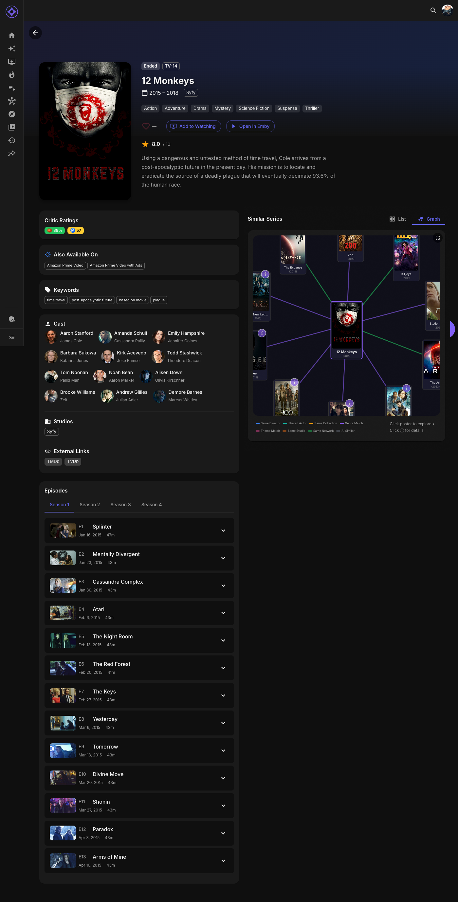

# Series Details

The Series Detail page shows comprehensive information about a TV series.

## Page Sections

### Header

- **Backdrop** — Full-width fanart image
- **Poster** — Series poster with heart rating overlay
- **Title & Year** — Series name and premiere year
- **Metadata** — Seasons, episodes, network, status
- **Play Button** — Resume or start watching

### Overview

The series' plot synopsis and description.

### Series Status

| Status | Meaning |
|--------|---------|
| **Continuing** | Still producing new episodes |
| **Ended** | Series has concluded |
| **Canceled** | Cancelled before planned ending |

### Ratings

| Rating | Source |
|--------|--------|
| **Community Rating** | From your media server |
| **Rotten Tomatoes** | Critic score (if available) |
| **Metacritic** | Metascore (if available) |
| **Your Rating** | Your personal heart rating |

### Cast & Crew

- **Creator** — Show creator (click for their page)
- **Cast** — Main cast with photos
- **Click any person** — View their full filmography

### Technical Info

| Field | Description |
|-------|-------------|
| **Network** | Original broadcast network |
| **Premiere** | First episode air date |
| **Seasons** | Total season count |
| **Episodes** | Total episode count |

---

## Seasons & Episodes

### Season List

Browse all seasons with:

- Season number and year
- Episode count
- Expand to see episodes

### Episode List

Each episode shows:

- Episode number and title
- Air date
- Runtime
- Watch status (watched/unwatched)
- Episode rating

### Watch Progress

Visual indicators show:

- ✓ Watched episodes
- ▶ Currently watching (in progress)
- Unaired episodes (future dates)

---

## Similar Series

AI-powered similar series suggestions:

### List View

A grid of similar series with:

- Poster thumbnails
- Title, year, and network
- Match percentage
- Heart rating

### Graph View

Interactive visualization showing:

- Series as poster nodes
- Connections by actors, creators, genres
- Click to explore related content

See [Similarity Graphs](similarity-graphs.md) for details.

---

## Series Insights

If this series was recommended to you, click **Why This Pick?** to see:

### Match Score Breakdown

| Factor | Description |
|--------|-------------|
| **Taste Match** | How well it matches your preferences |
| **Discovery** | How much it expands your viewing |
| **Quality** | Community and critic ratings |
| **Variety** | How it diversifies recommendations |

### Evidence Trail

Series from your watch history that influenced this recommendation.

### AI Explanation

Natural language explanation of why this was picked (if enabled).

---

## Actions

### Rating

Click the heart to rate the series (1-10 hearts):

- Rating affects future recommendations
- Syncs with Trakt if connected

### Play

Click **Play** to:

- Resume where you left off
- Start from the beginning if new

### Mark Unwatched

If enabled by your admin:

| Action | Effect |
|--------|--------|
| **Mark Episode Unwatched** | Removes single episode from history |
| **Mark Season Unwatched** | Removes entire season |
| **Mark Series Unwatched** | Removes all episodes |

---

## Navigation

- Click **Back** or use browser back to return
- Click any person's name to view their page
- Click the network to see other series
- Click season headers to expand/collapse

---

**Next:** [Watch History](watch-history.md)
