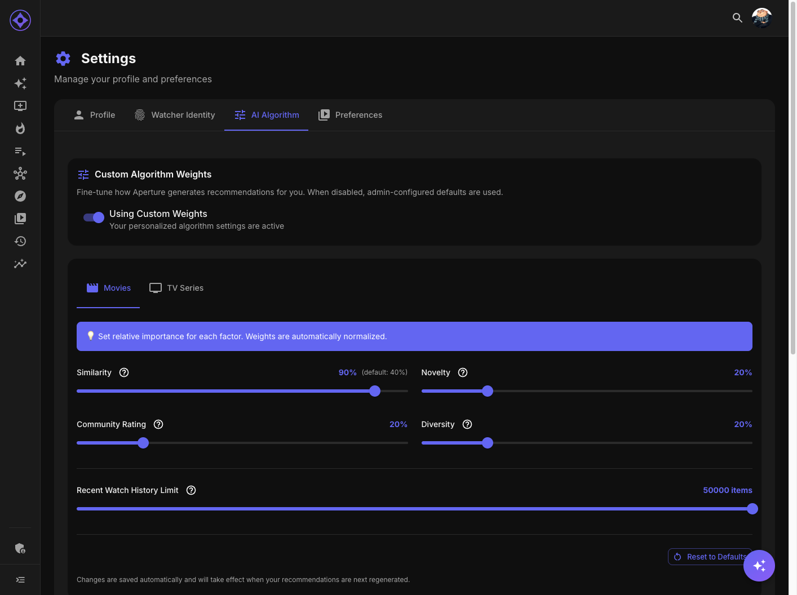

# AI Algorithm Weights

Customize how Aperture's AI generates your personalized recommendations by adjusting scoring weights.



## Accessing Algorithm Settings

1. Click your avatar in the top navigation bar
2. Select **Settings**
3. Click the **AI Algorithm** tab

---

## How Weights Work

### Scoring System

Each recommendation candidate is scored using weighted factors:

```
Final Score = (Factor1 × Weight1) + (Factor2 × Weight2) + ...
```

Higher weights = more influence on final ranking.

### Default vs Custom

- **Server defaults** — Set by your admin
- **Your customization** — Adjust to your preferences
- Your settings override server defaults

---

## Movie Weights

### Similarity Weight

How much to favor movies similar to what you've enjoyed.

| Setting | Effect |
|---------|--------|
| **High** | Strong preference for "more of what you like" |
| **Medium** | Balanced with other factors |
| **Low** | More variety, less similarity focus |

**Increase if:** You want recommendations closely matching your taste
**Decrease if:** You want to discover new genres/styles

### Popularity Weight

How much to consider general audience popularity.

| Setting | Effect |
|---------|--------|
| **High** | Favor widely-loved, mainstream content |
| **Medium** | Balanced consideration |
| **Low** | Hidden gems over popular hits |

**Increase if:** You enjoy popular, well-known movies
**Decrease if:** You prefer indie/obscure content

### Recency Weight

How much to prefer newer releases.

| Setting | Effect |
|---------|--------|
| **High** | Strong preference for recent movies |
| **Medium** | Balanced across all years |
| **Low** | Classics weighted equally with new releases |

**Increase if:** You want to stay current
**Decrease if:** You love classic films

### Rating Weight

How much community/critic ratings influence recommendations.

| Setting | Effect |
|---------|--------|
| **High** | Favor highly-rated content |
| **Medium** | Balanced consideration |
| **Low** | Rating matters less than other factors |

**Increase if:** You trust critic/audience scores
**Decrease if:** You have unconventional taste

### Diversity Weight

How much to ensure variety in your recommendations.

| Setting | Effect |
|---------|--------|
| **High** | Active effort to diversify genres/styles |
| **Medium** | Some variety ensured |
| **Low** | Recommendations may cluster in preferences |

**Increase if:** You want to branch out
**Decrease if:** You know what you like

---

## Series Weights

The same weight categories apply to TV series:

| Weight | Series-Specific Considerations |
|--------|--------------------------------|
| **Similarity** | Based on series you've watched |
| **Popularity** | TV-specific trending data |
| **Recency** | Recent premieres vs classics |
| **Rating** | Series average ratings |
| **Diversity** | Variety in show types |

### Series-Specific Factors

Some weights may include:

- **Completed series** preference
- **Ongoing series** preference
- **Episode count** considerations
- **Network/streaming** preferences

---

## Using the Sliders

### Adjusting Weights

1. Find the weight you want to adjust
2. Drag the slider left (decrease) or right (increase)
3. Watch the preview of how it affects recommendations
4. Click **Save** when satisfied

### Weight Scale

Typically 0-100 or 0-10 scale:

| Range | Meaning |
|-------|---------|
| **0-20** | Minimal influence |
| **20-40** | Low influence |
| **40-60** | Moderate influence |
| **60-80** | High influence |
| **80-100** | Maximum influence |

### Relative Weights

What matters is the **ratio** between weights:

- All at 50 = all equally weighted
- Similarity at 80, others at 40 = similarity twice as important
- Setting one to 0 = completely ignores that factor

---

## Preview Mode

Some interfaces show a preview:

### Before/After

See how weight changes affect your recommendations:

- **Current picks** with existing weights
- **Preview picks** with new weights
- Highlighted items that would change ranking

### Testing Changes

1. Adjust weights
2. View preview
3. Decide if changes improve recommendations
4. Save or discard

---

## Presets

Quick preset options may be available:

| Preset | Description |
|--------|-------------|
| **Balanced** | All weights equal |
| **Similarity Focus** | Emphasizes taste match |
| **Discovery** | Emphasizes variety and diversity |
| **Quality** | Emphasizes ratings |
| **Trending** | Emphasizes popularity and recency |

Click a preset to apply those weights instantly.

---

## Tips

### Start Balanced

Begin with default weights, then adjust one at a time to see effects.

### Small Adjustments

Small changes (10-20 points) can have noticeable effects. Avoid extreme swings.

### Give It Time

After changing weights, generate new recommendations and watch a few before adjusting again.

### Consider Your Goals

| Goal | Weight Adjustments |
|------|-------------------|
| More of what I love | ↑ Similarity |
| Expand my horizons | ↑ Diversity, ↓ Similarity |
| Quality over quantity | ↑ Rating |
| Stay current | ↑ Recency |
| Find hidden gems | ↓ Popularity |

---

## Reset to Defaults

Click **Reset to Server Defaults** to restore admin-configured weights.

This doesn't delete your watch history or ratings—just the weight customizations.

---

**Next:** [Watcher Identity](watcher-identity.md)
