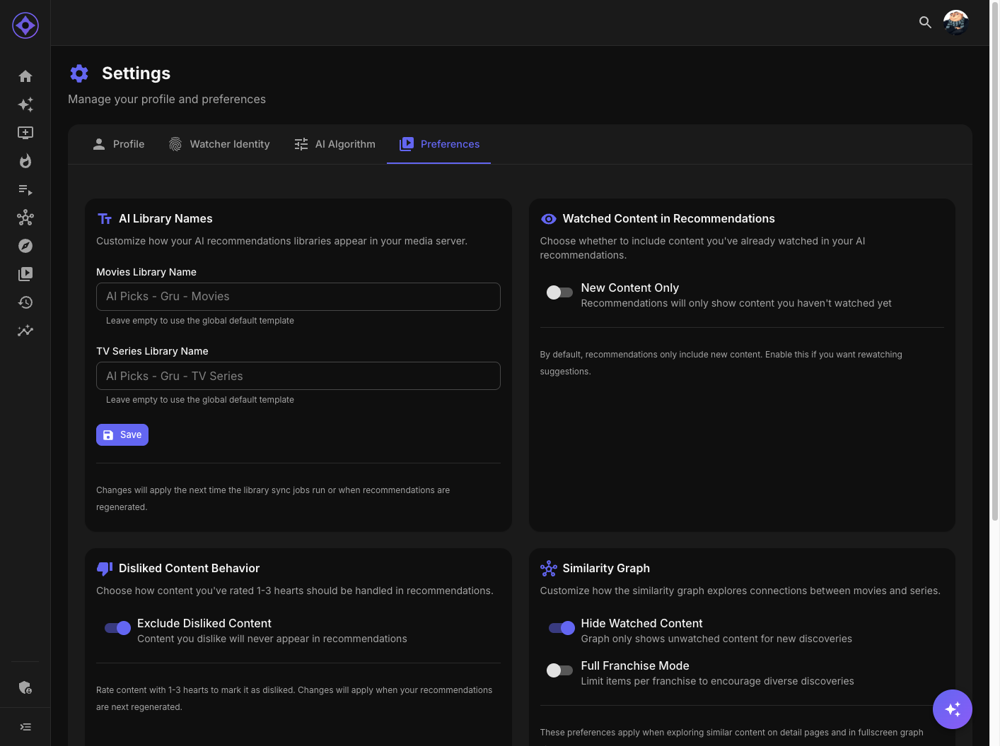

# Preferences

Preferences control how Aperture displays content and behaves for your account.

## Accessing Preferences

1. Click your avatar in the top navigation bar
2. Select **Settings**
3. Click the **Preferences** tab

---

## Library Names

Customize the names of your virtual libraries in Emby/Jellyfin.

### Available Libraries

| Library | Default Name | Your Custom Name |
|---------|--------------|------------------|
| AI Movie Picks | "AI Picks - [Username] - Movies" | Your choice |
| AI Series Picks | "AI Picks - [Username] - Series" | Your choice |
| Shows You Watch | "Shows You Watch - [Username]" | Your choice |

### Setting Custom Names

1. Enter your preferred name in each field
2. Click **Save**
3. Library updates on next sync

### Tips

- Keep names short for mobile display
- Use consistent naming patterns
- Avoid special characters that may cause issues

---

## Dislike Behavior

Control how low ratings affect your recommendations.

### Options

| Option | Effect |
|--------|--------|
| **Exclude** | Items similar to 1-3 star ratings are completely excluded |
| **Penalize** | Items similar to dislikes are ranked lower but may appear |

### When to Use Each

**Exclude (Default):**
- Strong preferences about what you don't like
- Want cleaner recommendations
- Genres you never want to see

**Penalize:**
- Open to being surprised
- Want more diverse recommendations
- Mild dislikes, not hard nos

### How It Works

1. You rate a movie 2 hearts
2. AI identifies similar content
3. **Exclude:** Similar content removed from candidates
4. **Penalize:** Similar content gets lower scores

---

## AI Explanations

Control whether you see natural language explanations with recommendations.

### Toggle Options

| Setting | Effect |
|---------|--------|
| **Enabled** | Each recommendation includes "Why this pick?" explanation |
| **Disabled** | Only show match scores, no text explanation |

### Example Explanation

When enabled, recommendations show:

> "This psychological thriller shares the mind-bending narrative style you enjoyed in Inception and Memento, with strong performances and a satisfying twist ending."

### Considerations

- Explanations require AI processing
- May slightly slow recommendation generation
- Provides insight into "why" not just "what"

---

## Similarity Graph Settings

Configure the behavior of similarity graphs throughout Aperture.

### Auto-Expand

| Setting | Effect |
|---------|--------|
| **On** | Similarity graphs start expanded |
| **Off** | Graphs start collapsed, click to expand |

### Hide Watched in Graphs

| Setting | Effect |
|---------|--------|
| **On** | Watched content hidden by default |
| **Off** | All similar content shown |

### Connection Types

Choose which relationship types to display:

| Type | Example |
|------|---------|
| **Cast** | Shared actors |
| **Crew** | Shared directors/writers |
| **Genre** | Genre similarity |
| **Theme** | Thematic similarity |
| **Embedding** | AI-detected similarity |

Toggle each type on/off to customize your graph view.

---

## Browse Sort Preferences

Your default sort order for the Browse page.

### Current Settings

Shows your saved sort preferences:

| Library | Sort By | Order |
|---------|---------|-------|
| Movies | [Your choice] | Asc/Desc |
| Series | [Your choice] | Asc/Desc |

### How It's Set

Sort preferences are set automatically:

1. Change sort on the Browse page
2. Preference is saved immediately
3. Applied next time you visit

You can also reset to defaults here.

---

## View Mode Preferences

Your preferred view mode (grid/list) for each page.

### Pages with View Modes

| Page | Options |
|------|---------|
| Browse | Grid / List |
| Recommendations | Grid / List |
| Top Picks | Grid / List |
| Discovery | Grid / List |
| Watch History | Grid / List |
| Shows You Watch | Grid / List |

### How It Works

1. Toggle view mode on any page
2. Preference saved automatically
3. Page remembers your choice

### Resetting

Click **Reset View Preferences** to return all pages to default (grid) view.

---

## Filter Presets

Manage your saved filter combinations for the Browse page.

### Viewing Presets

Lists all your saved filter presets:

| Preset | Type | Filters |
|--------|------|---------|
| "90s Action" | Movies | Year: 1990-1999, Genre: Action |
| "Short Docs" | Movies | Runtime: < 90min, Genre: Documentary |

### Managing Presets

| Action | How |
|--------|-----|
| **Rename** | Click the edit icon |
| **Delete** | Click the trash icon |
| **Load** | Go to Browse page, click preset |

### Creating Presets

Presets are created from the Browse page:

1. Set up your filters
2. Click **Presets** → **Save Current**
3. Name your preset
4. Click **Save**

---

## Reset Options

### Reset All Preferences

Restores all preferences to defaults:

- Library names reset
- Dislike behavior → Exclude
- View modes → Grid
- Filter presets → Cleared

**Warning:** This cannot be undone.

### Reset Individual Settings

Most sections have individual reset options for fine-grained control.

---

**Next:** [AI Algorithm Weights](ai-algorithm.md)
