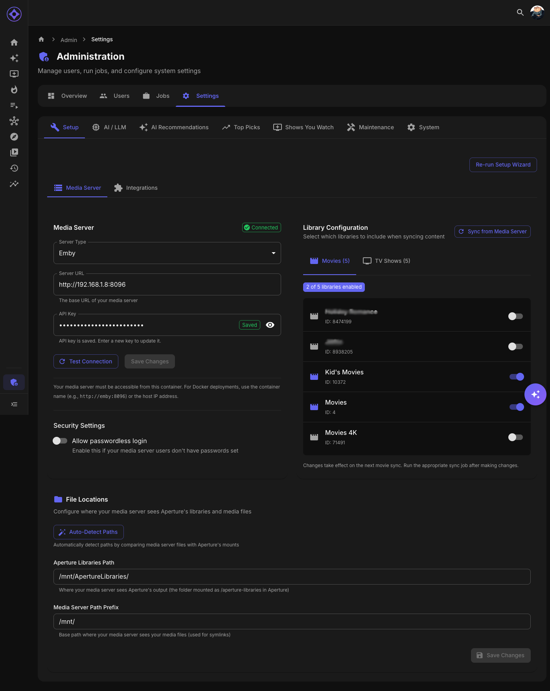

# Virtual Libraries

Virtual Libraries are special libraries that Aperture creates in your Emby or Jellyfin server, providing direct access to AI-curated content.



## What Are Virtual Libraries?

Virtual libraries appear alongside your regular libraries but contain:

- AI recommendations
- Top picks
- Shows you watch

They use **STRM files** or **symlinks** to reference your actual media without duplicating content.

---

## Types of Virtual Libraries

### AI Recommendations

Personal recommendation libraries:

| Library | Contents |
|---------|----------|
| **AI Picks - Movies** | Your personalized movie recommendations |
| **AI Picks - Series** | Your personalized series recommendations |

Named per-user: "AI Picks - YourName - Movies"

### Top Picks

Server-wide trending content:

| Library | Contents |
|---------|----------|
| **Top Movies This Week** | Most popular movies |
| **Top Series This Week** | Most popular series |

Shared across all users.

### Shows You Watch

Personal tracking library:

| Library | Contents |
|---------|----------|
| **Shows You Watch** | Series you're actively following |

Named per-user: "Shows You Watch - YourName"

---

## How They Work

### STRM Technology

Virtual libraries can use STRM (stream) files:

1. Aperture creates small .strm files
2. Each file points to your actual media
3. Media server reads the pointer
4. Plays the original file

**Benefits:**
- No duplicate storage used
- Original quality maintained
- Instant library creation

### Symlinks (Alternative)

Admins can also choose symlinks:

1. Aperture creates symbolic links
2. Links point to original files
3. Media server treats them as regular files

**Benefits:**
- Native playback support
- Better compatibility with some clients
- Original file metadata preserved

### Automatic Updates

Virtual libraries update automatically:

| Library Type | Update Trigger |
|--------------|----------------|
| AI Recommendations | When recommendation job runs |
| Top Picks | When popularity is recalculated |
| Shows You Watch | When you watch episodes |

---

## Accessing Virtual Libraries

### In Emby/Jellyfin

Virtual libraries appear in your library list:

1. Open your media server app
2. Browse libraries
3. Select any Aperture library
4. Browse and play content

### From Aperture

Content in virtual libraries is also accessible from Aperture:

- Recommendations page → AI recommendations library
- Top Picks page → Top Picks library
- Shows You Watch page → Shows You Watch library

---

## Library Names

### Default Names

Your admin configures default naming patterns:

| Pattern | Example |
|---------|---------|
| **Per-user with type** | "AI Picks - John - Movies" |
| **Simple** | "AI Movie Recommendations" |
| **Custom** | Whatever your admin configures |

### Custom Names

You can customize your library names in [Preferences](user-settings/preferences.md):

- Set custom names for your personal libraries
- Names sync to the media server
- Changes take effect on next update

---

## Visibility

### Personal Libraries

Your personal libraries (recommendations, shows you watch) are:

- Visible only to you
- Based on your viewing data
- Managed by your account

### Shared Libraries

Top Picks libraries are:

- Visible to all users
- Based on server-wide data
- Managed by admins

---

## Sorting in Libraries

Content in virtual libraries maintains meaningful order:

| Library | Sort Order |
|---------|------------|
| AI Recommendations | By recommendation rank |
| Top Picks | By popularity rank |
| Shows You Watch | By next episode date |

Your media server may override with its own sorting, but Aperture provides optimal default order.

---

## Storage Location

STRM files or symlinks are stored in a configured location:

### Default Location

Configured by your admin during setup:

```
/path/to/aperture/strm/
├── users/
│   └── john/
│       ├── ai-picks-movies/
│       ├── ai-picks-series/
│       └── shows-you-watch/
└── shared/
    ├── top-movies/
    └── top-series/
```

### File Structure

Each STRM file is tiny (~100 bytes):

```
#EXTINF:-1,Movie Title (2023)
/path/to/actual/movie/file.mkv
```

---

## Troubleshooting

### Library Not Appearing

1. Check if the job ran successfully
2. Verify STRM/symlink path is accessible
3. Rescan libraries in your media server
4. Ask admin to check configuration

### Content Not Playing

1. Verify original media exists
2. Check file permissions
3. Ensure STRM points to correct path
4. Try playing directly from main library

### Library Not Updating

1. Check if the corresponding job ran
2. Force a rescan in media server
3. Ask admin to manually trigger update

---

## Admin Configuration

Admins configure virtual libraries in Settings:

| Setting | Effect |
|---------|--------|
| **Output Format** | STRM files or symlinks |
| **Output Path** | Where files are created |
| **Library Names** | Default naming patterns |
| **Enable/Disable** | Which library types to create |
| **User Permissions** | Who gets personal libraries |

See the [Admin Guide](../admin-guide.md) for configuration details.

---

**Next:** [Encore Chatbot](ai-assistant.md)
