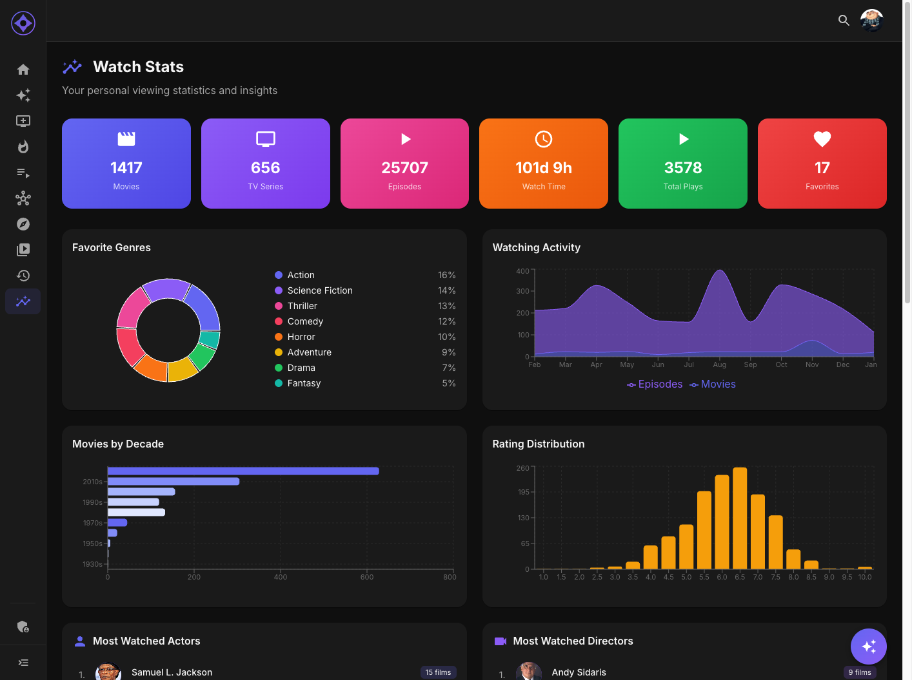

# Watch Stats

The Watch Stats page provides detailed analytics and insights about your viewing habits.

## Accessing Watch Stats

Navigate to **Watch Stats** in the sidebar (chart icon).

---

## Summary Cards

At the top, quick stats about your viewing:

| Stat | Description |
|------|-------------|
| **Total Movies** | Movies you've watched |
| **Total Episodes** | TV episodes watched |
| **Watch Time** | Cumulative viewing time |
| **Favorites** | Items you've rated 8+ hearts |

---

## Favorite Genres

An interactive donut chart showing your genre preferences:

- **Segments** — Each genre's proportion of your viewing
- **Hover** — See exact counts and percentages
- **Click** — Filter to see content in that genre
- **Colors** — Distinct colors for each genre

This shows what types of content you gravitate toward most.

---

## Watch Timeline

A monthly activity chart showing when you watch:

- **Bar heights** — Amount watched each month
- **Hover** — See exact counts for that month
- **Trends** — Identify your most active viewing periods

Useful for seeing seasonal viewing patterns.

---

## Decades

A bar chart showing which eras of content you prefer:

| Decade | Example |
|--------|---------|
| 1970s | Classic films |
| 1980s | Blockbuster era |
| 1990s | Modern classics |
| 2000s | Digital era |
| 2010s | Streaming age |
| 2020s | Current releases |

See if you prefer classics or newer content.

---

## Ratings Distribution

A chart showing how you rate content:

- **X-axis** — Rating values (1-10 hearts)
- **Y-axis** — Count of items
- **Pattern** — See if you're a generous or tough rater

Most users cluster around 6-8 hearts.

---

## Top Actors

Your most-watched actors:

- **Profile photos** — Visual identification
- **Name** — Click to view their page
- **Watch count** — How many of their titles you've seen
- **Top titles** — Their most-watched by you

Discover actors you didn't realize you watch so much.

---

## Top Directors

Your most-watched directors:

- **Profile photos** — Visual identification
- **Name** — Click to view filmography
- **Watch count** — Films of theirs you've seen
- **Top films** — Their work you've watched most

Find directors whose style you enjoy.

---

## Top Studios

For movies, your most-watched production studios:

- **Studio name** — Click to see their catalog
- **Watch count** — How many of their films
- **Notable titles** — Examples from your history

See which studios produce content you enjoy.

---

## Top Networks

For TV series, your most-watched networks:

| Network | Examples |
|---------|----------|
| HBO | Prestige dramas |
| Netflix | Streaming originals |
| BBC | British productions |
| AMC | Cable dramas |

Discover which networks align with your taste.

---

## Using Your Stats

### Understand Your Taste

- High percentage in certain genres? You know what you like
- Diverse genres? You're an eclectic viewer
- Clustered decades? You have era preferences

### Improve Recommendations

Your stats feed into AI recommendations:

- Genre weights inform suggestions
- Actor preferences are considered
- Era preferences influence picks

### Find New Content

- Click on underrepresented genres to explore
- Visit top actors/directors for more of their work
- Check networks you haven't tried

---

**Next:** [Franchises](franchises.md)
